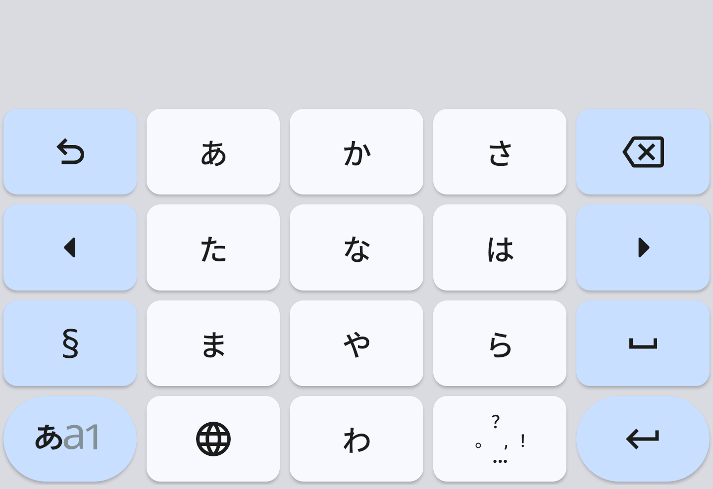
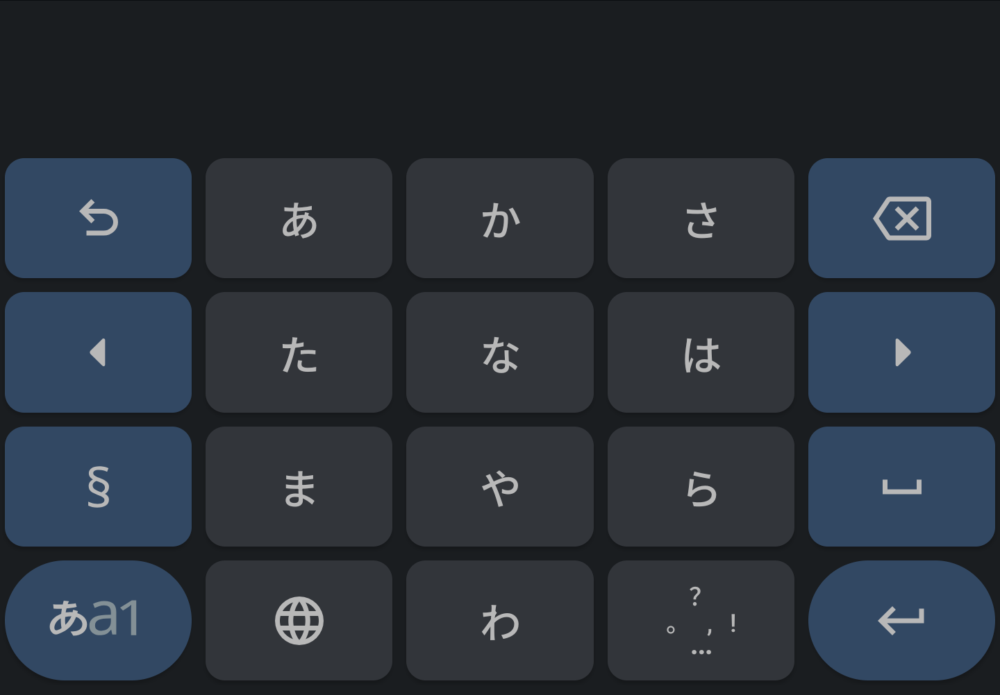
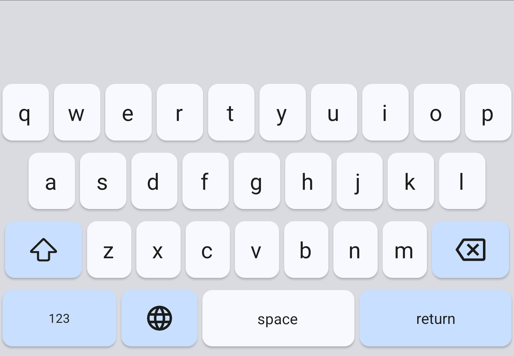
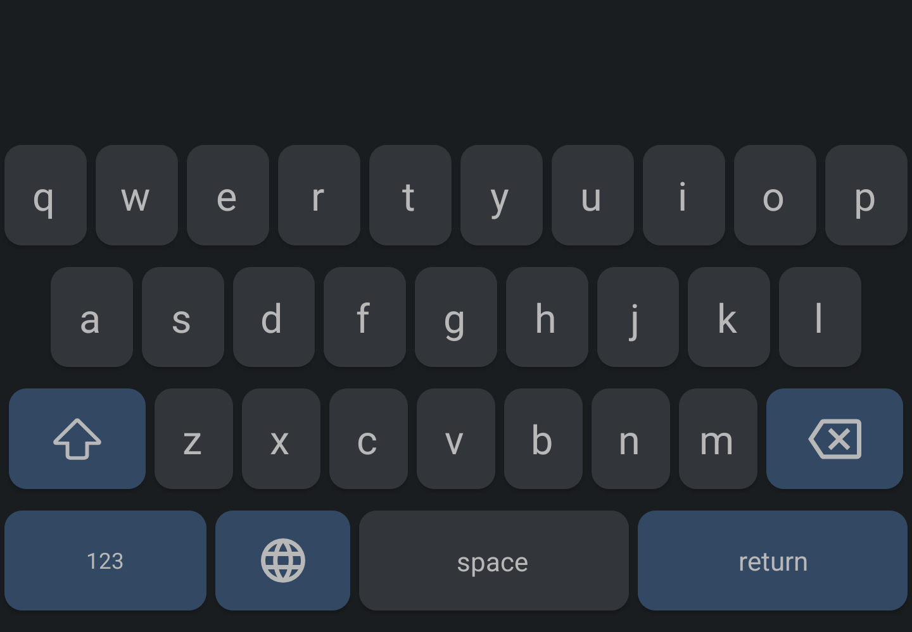
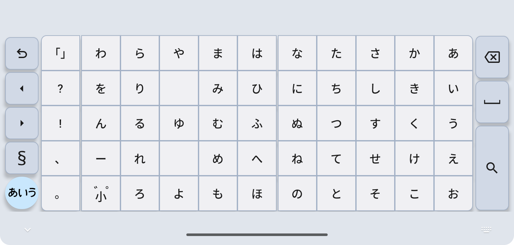
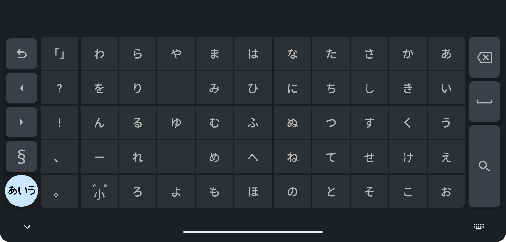

# Sumire (スミレ) — The Privacy-First Japanese Keyboard

<p align="center">
  
</p>
<h3 align="center">Your Keys, Your Data, Your Style.</h3>
<p align="center">あなたの手に、プライバシーと自由を。</p>

<p align="center">
  <a href="https://play.google.com/store/apps/details?id=com.kazumaproject.markdownhelperkeyboard"></a>
  <a href="https://f-droid.org/packages/com.kazumaproject.markdownhelperkeyboard.lite.fdroid/"></a>
  <a href="https://github.com/KazumaProject/JapaneseKeyboard/releases"></a>
</p>


<p align="center">
  <a href="https://github.com/KazumaProject/JapaneseKeyboard/actions/workflows/android.yml"></a>
  <a href="LICENSE"></a>
  
  
</p>

---

* [🗾 **日本語**](#日本語)
* [🌐 **English**](#english)

---

## 日本語

### 📜 コンセプト

Sumireは、**プライバシーを絶対に妥協しない**
という哲学から生まれた日本語入力キーボードです。あなたの思考や会話が、意図せず第三者に渡るべきではありません。すべての変換処理をデバイス内で完結させることで、100%のオフライン動作を実現しました。

オープンソースの`mozc`エンジンを基盤としながら、**強力なユーザー辞書**、**便利な定型文**、そして**自由なキーボード定義**といった高度なパーソナライズ機能を追加し、書くことそのものを、あなただけの体験にすることを目指しています。

### ✨ 主な特徴

* 🔒 **完全オフライン保証**
  `INTERNET`権限を要求せず、入力と変換を端末内で処理します。

* 🧠 **高性能な変換エンジン**
  Google日本語入力のコアである`mozc`の大規模辞書を搭載。文脈を読んだ高精度な変換を実現します。

* 📖 **強力なユーザー辞書**
  登録した単語を前方一致でスムーズに予測変換。インポート/エクスポート対応で、辞書のバックアップや移行も自由自在です。

* 📋 **便利な定型文（スニペット）**
  メールアドレスや挨拶など、よく使う文章を「読み」で全文一致呼び出し。インポート/エクスポートにも対応しています。

* 🎨 **究極のカスタマイズ**
  ユーザー自身がキー配列を定義できるカスタムキーボード機能を搭載。あなただけのキーボードを作成できます。

* 📱 **モダンな設計**
  Kotlinでフルスクラッチ開発。Jetpackライブラリによる最適化で、軽快な動作と滑らかなUIを実現。タブレット端末にも対応しています。

### 📷 スクリーンショット

<p align="center">
  <b>通常表示 (ライト/ダーク)</b><br>
  
  
</p>
<p align="center">
  <b>QWERTYレイアウトと絵文字</b><br>
  
  
</p>
<p align="center">
  <b>タブレット表示</b><br>
  
  
</p>

### 🚀 クイックスタート

1. 上記 **Google Play**
   バッジ、[F-Droid](https://f-droid.org/packages/com.kazumaproject.markdownhelperkeyboard.lite.fdroid/)、
   または[リリースページ](https://github.com/KazumaProject/JapaneseKeyboard/releases)
   からインストールします。F-Droid 版は `zenz` と `gemma` を含まない Lite 版です。
2. Androidの **設定 → システム → 言語と入力 → 画面キーボード** を開き、「**Sumire**」を有効にします。
3. 文字入力欄を長押し、またはキーボード切替アイコンをタップして「**Sumire**」を選択します。

### ⌨️ 入力モードと表示モード

`IMEService` では、入力モードと表示モードを分けて扱っています。入力モードは設定から表示順を変更できます。

| モード | 説明 |
|:--|:--|
| TenKey | 日本語かな入力向けの標準テンキーです。フリック/トグル入力、変換、候補表示に対応します。 |
| Sumire キーボード | スミレ独自のカスタムレイアウトです。ひらがな、英字、記号のレイアウトを切り替えられ、キー配置や入力スタイルも設定できます。 |
| QWERTY 英語 | 英字入力向けの QWERTY レイアウトです。英語入力、記号/数字レイアウト、Shift、ポップアップ表示に対応します。 |
| QWERTY ローマ字 | QWERTY 配列で日本語を入力するローマ字入力モードです。日本語変換候補と組み合わせて使えます。 |
| カスタムキーボード | ユーザーが作成したキーボード配列を読み込むモードです。複数レイアウトの切り替え、フリック、ローマ字変換、定型文字列の入力に対応します。 |
| Tablet | タブレット端末では、設定に応じて TenKey の代わりに五十音ベースのタブレット向けレイアウトを表示できます。 |
| フローティング | キーボードを画面下部に固定せず、独立したフローティングウィンドウとして表示できます。位置は保存され、通常の候補表示や入力処理と組み合わせて使えます。 |

### ⚙️ ユーザー設定

以下は `pref_*.xml` に定義されている設定項目です。保存値の初期値は `AppPreference.kt` を優先し、値を保存しない画面遷移や実行系の項目は「画面/操作」としています。`Zenz` と `Gemma` の設定は、これらを含む Full 版で表示されます。

<details>
<summary>設定一覧を開く</summary>

#### 共通

| カテゴリ | 設定 | 初期値 |
|:--|:--|:--|
| 言語 | 設定で表示する言語 | OFF |
| 設定のバックアップ | 設定をエクスポート | 画面/操作 |
| 設定のバックアップ | 設定をインポート | 画面/操作 |
| キーボード | キーボードの選択 | 画面/操作 |
| キーボード | 位置とサイズの設定(縦画面) | 画面/操作 |
| キーボード | 位置とサイズの設定(横画面) | 画面/操作 |
| キーボード | キー・変換候補の文字サイズ | 画面/操作 |
| キーボード | キーボード背景画像 | 画面/操作 |
| キーボード | 背景画像の表示方法 | フィット |
| キーボード | キーボード背景画像を解除 | 画面/操作 |
| キーボード | キーボード背景動画 | 画面/操作 |
| キーボード | 背景動画の画質 | 高画質 |
| キーボード | キーボード背景動画を解除 | 画面/操作 |
| 変換候補 | N-Best | 4 |
| 変換候補 | 変換キーで文節を分割 | OFF |
| 変換候補 | 左右キーで文節を移動 | OFF |
| 変換候補 | ショートカットツールバー | OFF |
| 変換候補 | 変換候補タブ | OFF |
| 変換候補 | 候補タブの並び順 | 画面/操作 |
| 変換候補 | 変換欄の高さ | 画面/操作 |
| 変換候補 | 変換欄の高さ(横画面) | 画面/操作 |
| 変換候補 | 変換候補の列数 | 1 |
| 変換候補 | 変換候補の列数(横画面) | 1 |
| 変換候補 | パスワード入力時の変換候補 | ON |
| 変換候補 | 候補ハイライト時の削除キー動作 | ON |
| 変換候補 | ローマ字変換候補を表示 | OFF |
| 変換候補 > タイピングミス補正 | フリック（日本語） | OFF |
| 変換候補 > タイピングミス補正 | タイピングミス補正のしきい値 | 3000 |
| 変換候補 > タイピングミス補正 | QWERTY（英語） | OFF |
| 機能 | フリック・トグル入力 | OFF |
| 機能 | 削除キーの左フリック | ON |
| 機能 | 元に戻す機能 | OFF |
| 機能 | クリップボードの内容を変換欄に表示 | ON |
| 機能 | クリップボード タップで候補から削除 | OFF |
| 機能 | 半角スペースの利用 | OFF |
| 機能 | ライブ変換 β | OFF |
| 機能 | 修飾キー省略入力 | OFF |
| 機能 | 修飾キー省略入力のしきい値 | 1900 |
| 機能 | 変換キー長押しで AI 変換候補を追加する | OFF |
| 機能 | スペース長押しでカーソル移動 | OFF |
| 機能 | 最後に使ったキーボードを表示 | OFF |
| 機能 | フリック入力の感度 | 100 |
| ショートカットツールバー | ショートカットツールバーのカスタマイズ | 画面/操作 |
| 記号キーボード | 記号キーボードの初期画面 | 絵文字 |
| クリップボードの履歴 | クリップボードの履歴 | 画面/操作 |
| 操作 | 入力待機時間 | 1000 |
| バイブレーション | バイブレーションの有無 | ON |
| バイブレーション | キー押下音の有無 | OFF |
| バイブレーション | キー押下音の音量 | 0 |
| バイブレーション | バイブレーションのタイミング | 両方 |
| バイブレーション | 長押し時間 | 300 |
| ローマ字変換 | ローマ字変換のカスタマイズ | 画面/操作 |
| アプリについて | 使用した Open Source のライブラリ | 画面/操作 |
| アプリについて | アプリのバージョン | 画面/操作 |

#### かな入力

| カテゴリ | 設定 | 初期値 |
|:--|:--|:--|
| かな入力 レイアウトの設定 | 文字のサイズ | 画面/操作 |
| かな入力 レイアウトの設定 | IME 切り替えボタン | ON |
| かな入力 レイアウトの設定 | 英字入力は QWERTY | OFF |
| かな入力 レイアウトの設定 | キーガイドの表示 | OFF |

#### スミレ入力

| カテゴリ | 設定 | 初期値 |
|:--|:--|:--|
| スミレ入力キーボード | 文字サイズ | 画面/操作 |
| スミレ入力キーボード | キーの配置 | トグル入力 |
| スミレ入力キーボード | 入力スタイル | 通常入力 |
| スミレ入力キーボード | 英字入力は QWERTY | OFF |
| スミレ入力キーボード | フリックガイドの表示 | OFF |
| スミレ入力キーボード | ドーナツ入力の設定 | 画面/操作 |

#### QWERTY

| カテゴリ | 設定 | 初期値 |
|:--|:--|:--|
| QWERTY キーボード | キーのサイズ | 画面/操作 |
| QWERTY キーボード | パスワード入力時 | OFF |
| QWERTY キーボード | 上フリックを有効にする | OFF |
| QWERTY キーボード | 下フリックを有効にする | OFF |
| QWERTY キーボード | ローマ字キーボードの全角スペース | OFF |
| QWERTY キーボード | ポップアップウィンドウの表示 | ON |
| QWERTY キーボード | カーソルボタン | OFF |
| QWERTY キーボード | 句読点ボタン | OFF |
| QWERTY キーボード | 数字キー | OFF |
| QWERTY キーボード | IME 切り替えボタン | ON |
| QWERTY キーボード | 記号キーマップの表示 | OFF |
| QWERTY キーボード | ローマ字/英語切り替えキー | ON |
| QWERTY キーボード | Shift直後の1文字だけ大文字 | OFF |
| QWERTY キーボード | 数字キーボード切り替え時の入力モード | OFF |

#### カスタム

| カテゴリ | 設定 | 初期値 |
|:--|:--|:--|
| カスタムキーボード | 文字サイズ | 画面/操作 |
| カスタムキーボード | ２文字以上の出力を自動で確定 | ON |
| カスタムキーボード | 未入力時の表示 | ON |
| カスタムキーボード | カスタムローマ字での全角nの動作 | ON |
| カスタムキーボード | フリックガイドの表示 | OFF |

#### タブレット

| カテゴリ | 設定 | 初期値 |
|:--|:--|:--|
| タブレット | タブレットのレイアウト | ON |

#### 辞書

| カテゴリ | 設定 | 初期値 |
|:--|:--|:--|
| システムユーザー辞書 | システムユーザー辞書の作成 | 画面/操作 |
| N-gram | N-gram補正 | 画面/操作 |
| NG ワード | NG ワードを有効にする | ON |
| NG ワード | 非表示にする単語の一覧 | 画面/操作 |
| 学習辞書 | 学習辞書 | ON |
| 学習辞書 | 先頭の変換候補を学習 | OFF |
| 学習辞書 | 学習辞書で予測変換 | OFF |
| 学習辞書 | 予測変換 | 2 |
| ユーザー辞書 | ユーザー辞書 | ON |
| ユーザー辞書 | 予測変換 | 2 |
| 定型文 | 定型文 | ON |
| Mozc UT | 人名 | OFF |
| Mozc UT | 住所 | OFF |
| Mozc UT | Web | OFF |
| Mozc UT | Wiki | OFF |
| Mozc UT | Neologd | OFF |

#### Zenz

| カテゴリ | 設定 | 初期値 |
|:--|:--|:--|
| zenz の設定 | AI による予測変換を有効にする | OFF |
| zenz の設定 | タイピング修正を有効にする | OFF |
| zenz の設定 | zenz で変換候補を並び替える | OFF |
| zenz の設定 | モデルの読み込み元 | 画面/操作 |
| zenz の設定 | zenz で使用するプロフィールの設定 | 空 |
| zenz の設定 | 右側の文脈を利用する | OFF |
| zenz の設定 | zenz の連続推論の待ち時間（デバウンス） | 300 |
| zenz の設定 | zenz の変換コンテキストの上限 | 32 |
| zenz の設定 | zenz の最大のコンテキスト数 | 512 |
| zenz の設定 | zenz が使用するスレッド数 | 4 |

#### Gemma

| カテゴリ | 設定 | 初期値 |
|:--|:--|:--|
| Gemma 翻訳 | Gemma 4 を有効にする | OFF |
| Gemma 翻訳 | Gemma 実行バックエンド | CPU のみ |
| Gemma 翻訳 | 翻訳先の言語 | 英語 |
| Gemma 翻訳 | Gemma 4 モデルの読み込み | 画面/操作 |
| Gemma 翻訳 | Gemma プロンプト管理 | 画面/操作 |

</details>

### 🛠️ 開発者向け

#### ビルド環境

| Tool           | Version                    |
|:---------------|:---------------------------|
| Android Studio | Compatible with Android Gradle Plugin 8.10.1 |
| Gradle Plugin  | 8.10.1                     |
| JDK            | 17                         |

#### ビルド手順

```bash
# 1. リポジトリをクローン
git clone https://github.com/KazumaProject/JapaneseKeyboard.git
cd JapaneseKeyboard

# 2. USBデバッグを有効にしたデバイス/エミュレータでビルド & インストール
./gradlew installDebug
```

#### Zenz モデルをビルド時に生成する

`zenz` モジュールは、開発機のビルド時に Hugging Face から元モデルを取得し、`llama.cpp` で GGUF 変換と量子化を行った結果を APK/AAB に同梱します。アプリ実行時には通信しないため、`INTERNET` 権限は不要です。

```bash
./gradlew installDebug
```

必要に応じて以下も上書きできます。

```properties
# local.properties
zenzModelRepo=Miwa-Keita/zenz-v3.1-xsmall
zenzModelRevision=a728931c8b4867a53ca33d1ff3fe7360b0f15cd5
zenzModelQuantization=Q5_K_M
zenzModelAssetName=ggml-model-Q5_K_M.gguf
# 公開モデルなので通常は不要
# zenzModelHfToken=hf_xxx
```

このモードでは生成済みモデルを `zenz/build/generated/assets/zenzModel/main/ggml-model-Q5_K_M.gguf` に出力して APK/AAB に同梱します。Python 3 と CMake が必要で、初回は `huggingface_hub` と `llama.cpp` の変換用依存を自動で入れます。

#### 配布バリアント

このプロジェクトでは `edition` と `channel` の 2 軸で APK を出し分けます。

- `fullStandard`: 既定の全部入り版。`zenz` と `gemma` を含みます
- `liteStandard`: 軽量版。`zenz` と `gemma` を含みません
- `liteFdroid`: F-Droid 向け軽量版。`zenz` と `gemma` を含みません

`fullFdroid` は意図的に無効化しています。

各バリアントの `applicationId` は次の通りです。

- `fullStandard`: `com.kazumaproject.markdownhelperkeyboard`
- `liteStandard`: `com.kazumaproject.markdownhelperkeyboard.lite`
- `liteFdroid`: `com.kazumaproject.markdownhelperkeyboard.lite.fdroid`

ローカルで unsigned release APK を作る場合は次を使います。

```bash
./gradlew assembleFullStandardReleaseUnsigned
./gradlew assembleLiteStandardReleaseUnsigned
./gradlew assembleLiteFdroidReleaseUnsigned
```

署名付き release APK を作る場合は `local.properties` に署名情報を設定したうえで次を使います。

```bash
./gradlew assembleFullStandardRelease
./gradlew assembleLiteStandardRelease
./gradlew assembleLiteFdroidRelease
```

生成物は `app/build/outputs/apk/<variant>/...` に出力されます。GitHub Actions の release workflow でも同じ 3 バリアントを tag push 時にビルドします。

### 🤝 貢献するには

このプロジェクトはオープンソースです。バグ報告、機能提案、そしてプルリクエストを心から歓迎します。
貢献していただける方は、まず **[Issues](https://github.com/KazumaProject/JapaneseKeyboard/issues)**
を検索し、同様の課題が議論されていないかご確認ください。

### 🏗️ アーキテクチャ

キー入力から候補表示までの処理フローは以下の通りです。コアな変換ロジックは、LOUDSトライ木辞書とN-gram言語モデルに基づいています。

```text
+----------------------+      +----------------------+
|   Input (Key Event)  | ---> |  Candidate Generation|
+----------------------+      |  (LOUDS Dictionary)  |
                               +-----------+----------+
                                           |
+----------------------+      +----------+-----------+
| Suggestion Rendering | <--- |   Ranking (N-gram)   |
+----------------------+      +----------------------+
```

詳細は[DeepWikiの技術ドキュメント](https://deepwiki.com/KazumaProject/JapaneseKeyboard)をご参照ください。

### 🔐 プライバシーとセキュリティ

* **ネットワーク権限なし**: `AndroidManifest.xml`に`INTERNET`権限は含まれていません。音声入力では、端末側の音声認識を使うときにマイク権限を利用します。
* **暗号化された学習データ**: 予測変換のための学習履歴は、AES-256で暗号化され、安全にローカル保存されます。

### 📝 謝辞

本プロジェクトは、以下の素晴らしい技術や資料に支えられています。

* **Mozc Project**: [google/mozc](https://github.com/google/mozc) (BSD-3-Clause)
* **Mozc UT Dictionary**: [mozc-ut](http://linuxplayers.g1.xrea.com/mozc-ut.html) (CC BY-SA)
* 書籍『[日本語入力を支える技術](https://www.amazon.co.jp/dp/4774149934)』
* その他多数のオープンソースライブラリ

### 📄 ライセンス

**MIT License** © 2025 Kazuma Naka — 詳細は [`LICENSE`](LICENSE) ファイルをご覧ください。

-----

## English

### 📜 Philosophy

Sumire is a Japanese keyboard built on a single, uncompromising philosophy: **absolute privacy**.
Your thoughts and conversations should never be an asset for third parties. We achieve 100% offline
functionality by ensuring every process, from keystroke to candidate conversion, happens entirely on
your device.

Built on the open-source `mozc` engine, Sumire enhances the writing experience with advanced
personalization features like a **powerful user dictionary**, **convenient snippets**, and **fully
customizable keyboard layouts**, aiming to make typing a truly personal experience.

### ✨ Key Features

* 🔒 **100% Offline & Secure**
  Works without the `INTERNET` permission, so keyboard input is processed on device.

* 🧠 **Powerful Conversion Engine**
  Powered by the large-scale dictionary from `mozc` (the core of Google's Japanese IME) for highly
  accurate, context-aware predictions.

* 📖 **Powerful User Dictionary**
  Get predictive suggestions for your registered words via forward-matching search. Full
  import/export support gives you complete control over your dictionary.

* 📋 **Convenient Snippets**
  Instantly insert frequently used phrases, email addresses, or greetings using an exact-match
  trigger word. Also supports import/export.

* 🎨 **Ultimate Customization**
  Go beyond themes. Adjust key height and sensitivity, and even create your own fully custom
  keyboard layouts to perfectly match your typing style.

* 📱 **Modern by Design**
  Developed in Kotlin from the ground up and optimized with Jetpack libraries for a smooth, fast,
  and responsive UI. It's also optimized for tablets and foldables.

### 🚀 Quick Start

1. Install from the **Google Play** badge above,
   [F-Droid](https://f-droid.org/packages/com.kazumaproject.markdownhelperkeyboard.lite.fdroid/),
   or from
   the [Releases page](https://github.com/KazumaProject/JapaneseKeyboard/releases).
2. Open Android **Settings → System → Languages & input → On-screen keyboard** and enable **"Sumire"**.
3. Long-press any text field or tap the keyboard-switch icon and select **"Sumire"**.

### 🛠️ For Developers

See the Japanese section for the build environment and instructions.

```bash
git clone https://github.com/KazumaProject/JapaneseKeyboard.git
cd JapaneseKeyboard
./gradlew installDebug
```

### 🤝 Contributing

This is an open-source project, and we welcome bug reports, feature requests, and pull requests.
Please check the **[Issues](https://github.com/KazumaProject/JapaneseKeyboard/issues)** page to see
if your idea is already being discussed.

### 🔐 Privacy & Security

* **No Network Permission**: The `AndroidManifest.xml` does not contain the `INTERNET` permission.
  Voice input uses the microphone permission only when the device-side speech recognizer is used.
* **Encrypted Learning Data**: Your personal dictionary and learning data are stored locally,
  encrypted with AES-256.

### 📝 Acknowledgements

This project stands on the shoulders of giants. Our thanks go to:

* **The Mozc Project**: [google/mozc](https://github.com/google/mozc) (BSD-3-Clause)
* **Mozc UT Dictionary**: [mozc-ut](http://linuxplayers.g1.xrea.com/mozc-ut.html) (CC BY-SA)
* The book "[Gijutsu Hyoronsha](https://www.amazon.co.jp/dp/4774149934)" for its deep insights into
  Japanese input technology.

### 📄 License

**MIT License** © 2025 Kazuma Naka — See the [`LICENSE`](LICENSE) file for details.
