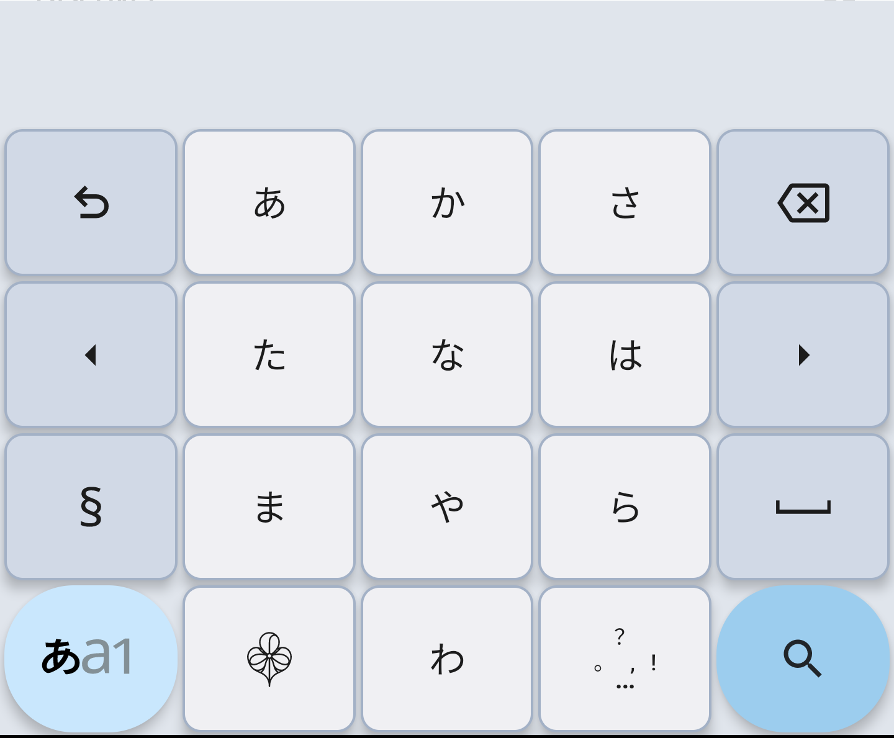

# Sumire (スミレ) — Offline Japanese Keyboard

<!-- SEO: offline japanese ime, privacy‑first japanese keyboard, android ime, mozc dictionary, 日本語入力, Markdown キーボード -->

<p align="center"></p>
<h3 align="center">100 % offline · 0 % data leak · 日本語入力をもっと自由に</h3>

[](https://play.google.com/store/apps/details?id=com.kazumaproject.markdownhelperkeyboard)
[](https://github.com/KazumaProject/JapaneseKeyboard/actions/workflows/android.yml)
[](https://github.com/KazumaProject/JapaneseKeyboard/releases)
[](LICENSE)


---

* [🗾 日本語](#日本語)
* [🌐 English](#english)

---

## 日本語

### 📑 目次

* [特徴](#特徴)
* [スクリーンショット](#スクリーンショット)
* [🚀 使い方 (ユーザー向け)](#使い方-ユーザー向け)
* [🛠 ソースからビルド (開発者向け)](#ソースからビルド-開発者向け)
* [🏗 アーキテクチャ](#アーキテクチャ)
* [🔐 プライバシーとセキュリティ](#プライバシーとセキュリティ)
* [🛡 技術スタック](#技術スタック)
* [📣 ロードマップ](#ロードマップ)
* [🤝 コントリビュート](#コントリビュート)
* [📝 謝辞](#謝辞)
* [📄 ライセンス](#ライセンス)

### 特徴

* **完全オフライン** — 機内モードでも動作、データは端末外へ一切送信されません。
* **ネットワーク権限ゼロ** — `AndroidManifest.xml` に `<uses-permission android:name="android.permission.INTERNET"/>` が存在しません。
* **mozc 辞書採用** — 豊富な語彙と高精度変換。
* **学習・予測変換** — 使用履歴を元に候補を最適化。
* **複数入力モード** — 日本語・英語・記号をワンタップ切替。
* **高速・軽量** — Kotlin + Jetpack で最適化、フリック UI も滑らか。
* **テーマ切替** — ライト / ダーク。

### スクリーンショット

<p align="center">
  
  
</p>

### 🚀 使い方 (ユーザー向け)

1. 上記 Play Store バッジからインストール。
2. **設定 → システム → 言語と入力 → キーボード → スミレ** を有効化。
3. 入力欄を長押しして「スミレ」を選択。

<details>
<summary>📦 APK を直接インストール</summary>

[リリースページ](https://github.com/KazumaProject/JapaneseKeyboard/releases)から apk をダウンロードし、端末へ転送後インストールしてください。提供元不明アプリの許可が必要です。
</details>

### 🛠 ソースからビルド (開発者向け)

| Tool           | Version           |
| -------------- | ----------------- |
| Android Studio | Hedgehog (2025.x) |
| Gradle Plugin  | 8.4               |
| JDK            | 21                |

```bash
# 1. clone
$ git clone https://github.com/KazumaProject/JapaneseKeyboard.git
$ cd JapaneseKeyboard

# 2. ビルド & インストール (USB デバッグ有効な実機orエミュレータ)
$ ./gradlew installDebug
```

### 🏗 アーキテクチャ

```text
         +----------------+
         |   キー入力      |
         +----------------+
                 |
                 v
   +---------------------------+
   |  候補生成 (LOUDS辞書)      |
   +---------------------------+
                 |
                 v
   +---------------------------+
   |  スコア計算               |
   |  (N‑gram, 品詞コスト)     |
   +---------------------------+
                 |
                 v
         +-------------+
         |  Ranking    |
         +-------------+
                 |
                 v
        +----------------+
        |  候補表示      |
        +----------------+
```

#### コアサブシステム

| # | サブシステム                | 主な責務                                          |
| - | --------------------- | --------------------------------------------- |
| 1 | IME Service           | 入力受付・モード切替・候補表示                               |
| 2 | Dictionary & Language | LOUDS 辞書, PathFinder, TokenArray              |
| 3 | Learning System       | LearnRepository, Room DB, 使用履歴ランキング           |
| 4 | UI Components         | TenKeyboardView, SuggestionView |
| 5 | Dependency Injection  | Hilt によるコンポーネント管理                             |

#### 辞書データ

| Dictionary    | 用途             | License      |
| ------------- | -------------- | ------------ |
| mozc          | Core Japanese  | BSD‑3‑Clause |
| mozc‑ut       | Extended words | CC BY‑SA     |
| jawiki‑titles | Cost 最適化       | CC BY‑SA     |
| english.dat   | 英語入力           | CC BY‑SA     |

### 🔐 プライバシーとセキュリティ

* **通信ゼロ** — MANIFEST に INTERNET / NETWORK\_STATE 権限なし。
* 入力履歴は `EncryptedSharedPreferences` に AES‑256 で保存。
* DI で SecurityManager を注入し、キー管理を統一。

### 🛡 技術スタック

| Category   | Tech                          |
| ---------- | ----------------------------- |
| Language   | Kotlin / Java                 |
| UI         | XML & Custom Views (Material) |
| DI         | Dagger‑Hilt                   |
| DB         | Room                          |
| Build      | Gradle 8.2                    |
| Min SDK    | 24 (Android 7.0)              |
| Target SDK | 35                            |

### 📝 謝辞

* DeepWiki: [プロジェクト技術ドキュメント](https://deepwiki.com/KazumaProject/JapaneseKeyboard)
* 書籍『[日本語入力を支える技術](https://www.amazon.co.jp/dp/4774149934)』
* 論文『[辞書と言語モデルの効率のよい圧縮とかな漢字変換への応用](https://www.anlp.jp/proceedings/annual_meeting/2011/pdf_dir/C4-2.pdf)』
* [Mozc](https://github.com/google/mozc) & [mozc‑ut 辞書](http://linuxplayers.g1.xrea.com/mozc-ut.html)
* [Trie4J](https://github.com/takawitter/trie4j) 他

### 📄 ライセンス

MIT © 2025 Kazuma Naka — See [`LICENSE`](LICENSE).

---

## English

### Table of Contents

* [Features](#features)
* [Screenshots](#screenshots)
* [🚀 Get Started](#get-started)
* [🛠 Build from Source](#build-from-source)
* [🏗 Architecture](#architecture)
* [🔐 Privacy & Security](#privacy--security)
* [🛡 Tech Stack](#tech-stack)
* [📣 Roadmap](#roadmap)
* [🤝 Contributing](#contributing)
* [📝 Acknowledgements](#acknowledgements)
* [📄 License](#license)

### Features

* **100 % offline** — Works even in airplane mode; nothing ever leaves your device.
* **No network permission** — The manifest contains **no** `android.permission.INTERNET`.
* **mozc dictionary** — Rich vocabulary & accurate conversion.
* **Adaptive learning** — AES‑256 encrypted local history improves suggestions.
* **Multiple input modes** — Japanese / English / Symbols in one tap.
* **Fast & lightweight** — Kotlin, optimized Ten‑key & flick UI.
* **Theme switcher** — Light / Dark & custom colors.

### Screenshots

<p align="center">
  
  
</p>

### 🚀 Get Started

1. Install from Play Store (badge above).
2. Enable **Settings → System → Languages & input → Keyboards → Sumire**.
3. Long‑press any input field and switch to **Sumire**.

### 🛠 Build from Source

See version table above, then:

```bash
git clone https://github.com/KazumaProject/JapaneseKeyboard.git
cd JapaneseKeyboard
./gradlew installDebug
```

### 🏗 Architecture

High‑level diagram in Japanese section. Core subsystems: IME Service, Dictionary, Learning, UI, DI.

### 🔐 Privacy & Security

* Zero network permission; audited manifest.
* EncryptedSharedPreferences (AES‑256) for user history.

### 🛡 Tech Stack

See Japanese table or DeepWiki page.

### 📝 Acknowledgements

See Japanese section and [DeepWiki documentation](https://deepwiki.com/KazumaProject/JapaneseKeyboard).

### 📄 License

MIT © 2025 Kazuma Naka — see [`LICENSE`](LICENSE).
