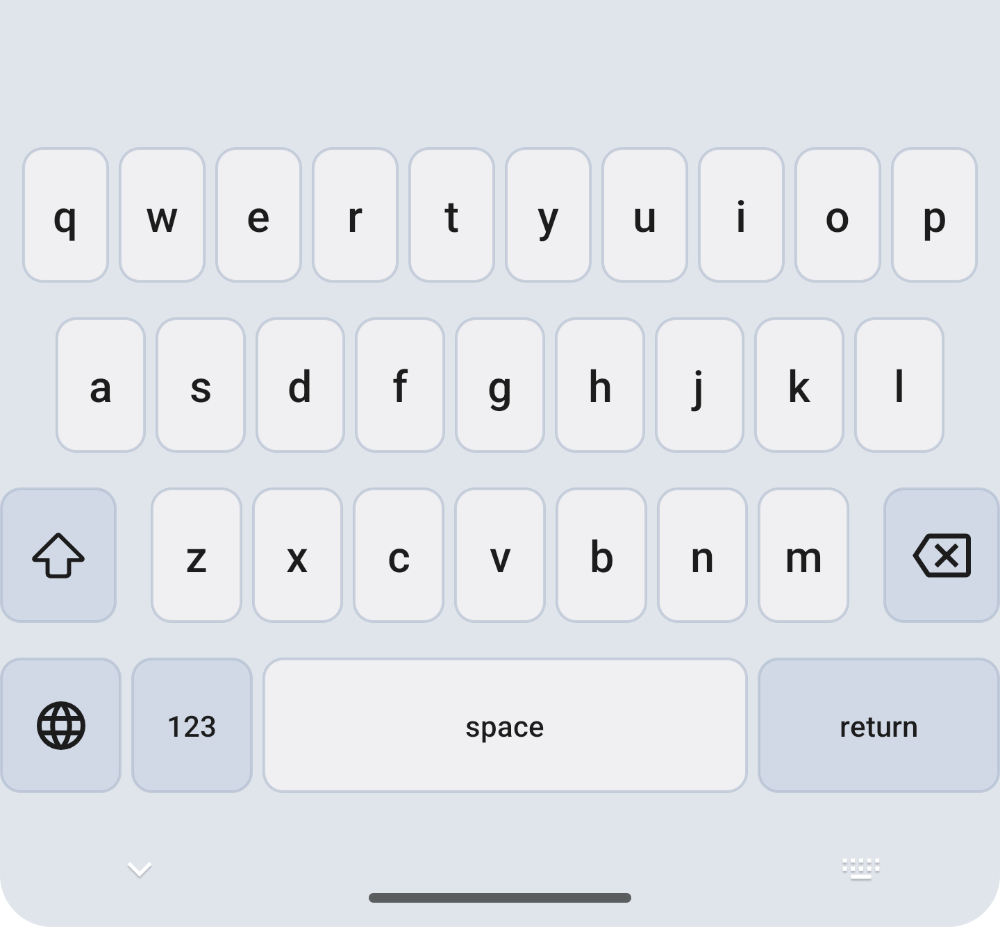
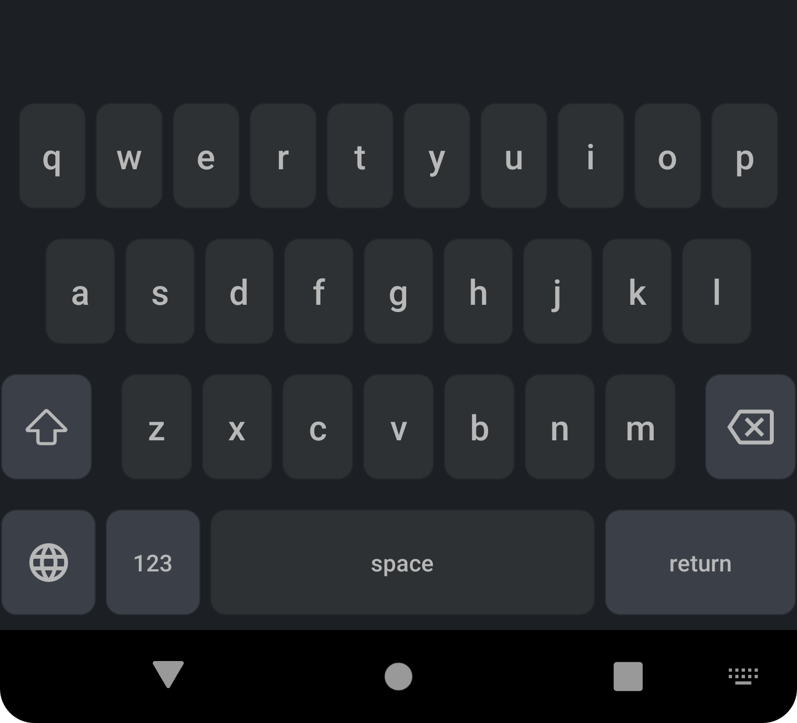

# Sumire (スミレ) — The Privacy-First Japanese Keyboard

<p align="center">
  
</p>
<h3 align="center">Your Keys, Your Data, Your Style.</h3>
<p align="center">あなたの手に、プライバシーと自由を。</p>

<p align="center">
  <a href="https://play.google.com/store/apps/details?id=com.kazumaproject.markdownhelperkeyboard"></a>
  <a href="https://github.com/KazumaProject/JapaneseKeyboard/releases"></a>
</p>


<p align="center">
  <a href="https://github.com/KazumaProject/JapaneseKeyboard/actions/workflows/android.yml"></a>
  <a href="LICENSE"></a>
  
  
</p>

---

* [🗾 **日本語**](#日本語)
* [🌐 **English**](#english)

---

## 日本語

### 📜 コンセプト

Sumireは、**プライバシーを絶対に妥協しない**
という哲学から生まれた日本語入力キーボードです。あなたの思考や会話が、意図せず第三者に渡るべきではありません。すべての変換処理をデバイス内で完結させることで、100%のオフライン動作を実現しました。

オープンソースの`mozc`エンジンを基盤としながら、**強力なユーザー辞書**、**便利な定型文**、そして*
*自由なキーボード定義**といった高度なパーソナライズ機能を追加し、書くことそのものを、あなただけの体験にすることを目指しています。

### ✨ 主な特徴

* 🔒 **完全オフライン保証**
  機内モードでも全機能が動作。`INTERNET`権限を要求しないため、入力データが外部に送信されることは一切ありません。

* 🧠 **高性能な変換エンジン**
  Google日本語入力のコアである`mozc`の大規模辞書を搭載。文脈を読んだ高精度な変換を実現します。

* 📖 **強力なユーザー辞書**
  登録した単語を前方一致でスムーズに予測変換。インポート/エクスポート対応で、辞書のバックアップや移行も自由自在です。

* 📋 **便利な定型文（スニペット）**
  メールアドレスや挨拶など、よく使う文章を「読み」で全文一致呼び出し。インポート/エクスポートにも対応しています。

* 🎨 **究極のカスタマイズ**
  ユーザー自身がキー配列を定義できるカスタムキーボード機能を搭載。あなただけのキーボードを作成できます。

* 📱 **モダンな設計**
  Kotlinでフルスクラッチ開発。Jetpackライブラリによる最適化で、軽快な動作と滑らかなUIを実現。タブレット端末にも対応しています。

### 📷 スクリーンショット

<p align="center">
  <b>通常表示 (ライト/ダーク)</b><br>
  
  
</p>
<p align="center">
  <b>QWERTYレイアウトと絵文字</b><br>
  
  
</p>
<p align="center">
  <b>タブレット表示</b><br>
  
  
</p>

### 🚀 クイックスタート

1. 上記 **Google Play**
   バッジ、または[リリースページ](https://github.com/KazumaProject/JapaneseKeyboard/releases)
   からインストールします。
2. Androidの **設定 → システム → 言語と入力 → 画面キーボード** を開き、「**Sumire**」を有効にします。
3. 文字入力欄を長押し、またはキーボード切替アイコンをタップして「**Sumire**」を選択します。

### 🛠️ 開発者向け

#### ビルド環境

| Tool           | Version                    |
|:---------------|:---------------------------|
| Android Studio | Iguana (2023.2.1) or newer |
| Gradle Plugin  | 8.4+                       |
| JDK            | 21                         |

#### ビルド手順

```bash
# 1. リポジトリをクローン
git clone [https://github.com/KazumaProject/JapaneseKeyboard.git](https://github.com/KazumaProject/JapaneseKeyboard.git)
cd JapaneseKeyboard

# 2. USBデバッグを有効にしたデバイス/エミュレータでビルド & インストール
./gradlew installDebug
````

### 🤝 貢献するには

このプロジェクトはオープンソースです。バグ報告、機能提案、そしてプルリクエストを心から歓迎します。
貢献していただける方は、まず **[Issues](https://github.com/KazumaProject/JapaneseKeyboard/issues)**
を検索し、同様の課題が議論されていないかご確認ください。

### 🏗️ アーキテクチャ

キー入力から候補表示までの処理フローは以下の通りです。コアな変換ロジックは、LOUDSトライ木辞書とN-gram言語モデルに基づいています。

```text
+----------------------+      +----------------------+
|   Input (Key Event)  | ---> |  Candidate Generation|
+----------------------+      |  (LOUDS Dictionary)  |
                               +-----------+----------+
                                           |
+----------------------+      +----------+-----------+
| Suggestion Rendering | <--- |   Ranking (N-gram)   |
+----------------------+      +----------------------+
```

詳細は[DeepWikiの技術ドキュメント](https://deepwiki.com/KazumaProject/JapaneseKeyboard)をご参照ください。

### 🔐 プライバシーとセキュリティ

* **ネットワーク権限ゼロ**: `AndroidManifest.xml`に`INTERNET`権限は含まれていません。インストール時にも権限を要求しません。
* **暗号化された学習データ**: 予測変換のための学習履歴は、AES-256で暗号化され、安全にローカル保存されます。

### 📝 謝辞

本プロジェクトは、以下の素晴らしい技術や資料に支えられています。

* **Mozc Project**: [google/mozc](https://github.com/google/mozc) (BSD-3-Clause)
* **Mozc UT Dictionary**: [mozc-ut](http://linuxplayers.g1.xrea.com/mozc-ut.html) (CC BY-SA)
* 書籍『[日本語入力を支える技術](https://www.amazon.co.jp/dp/4774149934)』
* その他多数のオープンソースライブラリ

### 📄 ライセンス

**MIT License** © 2025 Kazuma Naka — 詳細は [`LICENSE`](LICENSE) ファイルをご覧ください。

-----

## English

### 📜 Philosophy

Sumire is a Japanese keyboard built on a single, uncompromising philosophy: **absolute privacy**.
Your thoughts and conversations should never be an asset for third parties. We achieve 100% offline
functionality by ensuring every process, from keystroke to candidate conversion, happens entirely on
your device.

Built on the open-source `mozc` engine, Sumire enhances the writing experience with advanced
personalization features like a **powerful user dictionary**, **convenient snippets**, and **fully
customizable keyboard layouts**, aiming to make typing a truly personal experience.

### ✨ Key Features

* 🔒 **100% Offline & Secure**
  Works flawlessly in airplane mode. With **zero network permissions**, your data never leaves your
  device. Period.

* 🧠 **Powerful Conversion Engine**
  Powered by the large-scale dictionary from `mozc` (the core of Google's Japanese IME) for highly
  accurate, context-aware predictions.

* 📖 **Powerful User Dictionary**
  Get predictive suggestions for your registered words via forward-matching search. Full
  import/export support gives you complete control over your dictionary.

* 📋 **Convenient Snippets**
  Instantly insert frequently used phrases, email addresses, or greetings using an exact-match
  trigger word. Also supports import/export.

* 🎨 **Ultimate Customization**
  Go beyond themes. Adjust key height and sensitivity, and even create your own fully custom
  keyboard layouts to perfectly match your typing style.

* 📱 **Modern by Design**
  Developed in Kotlin from the ground up and optimized with Jetpack libraries for a smooth, fast,
  and responsive UI. It's also optimized for tablets and foldables.

### 🚀 Quick Start

1. Install from the **Google Play** badge above or from
   the [Releases page](https://github.com/KazumaProject/JapaneseKeyboard/releases).
2. Open Android **Settings → System → Languages & input → On-screen keyboard** and enable **"Sumire"
   **.
3. Long-press any text field or tap the keyboard-switch icon and select **"Sumire"**.

### 🛠️ For Developers

See the Japanese section for the build environment and instructions.

```bash
git clone [https://github.com/KazumaProject/JapaneseKeyboard.git](https://github.com/KazumaProject/JapaneseKeyboard.git)
cd JapaneseKeyboard
./gradlew installDebug
```

### 🤝 Contributing

This is an open-source project, and we welcome bug reports, feature requests, and pull requests.
Please check the **[Issues](https://github.com/KazumaProject/JapaneseKeyboard/issues)** page to see
if your idea is already being discussed.

### 🔐 Privacy & Security

* **Zero Network Permission**: The `AndroidManifest.xml` does not contain the `INTERNET` permission.
* **Encrypted Learning Data**: Your personal dictionary and learning data are stored locally,
  encrypted with AES-256.

### 📝 Acknowledgements

This project stands on the shoulders of giants. Our thanks go to:

* **The Mozc Project**: [google/mozc](https://github.com/google/mozc) (BSD-3-Clause)
* **Mozc UT Dictionary**: [mozc-ut](http://linuxplayers.g1.xrea.com/mozc-ut.html) (CC BY-SA)
* The book "[Gijutsu Hyoronsha](https://www.amazon.co.jp/dp/4774149934)" for its deep insights into
  Japanese input technology.

### 📄 License

**MIT License** © 2025 Kazuma Naka — See the [`LICENSE`](LICENSE) file for details.
