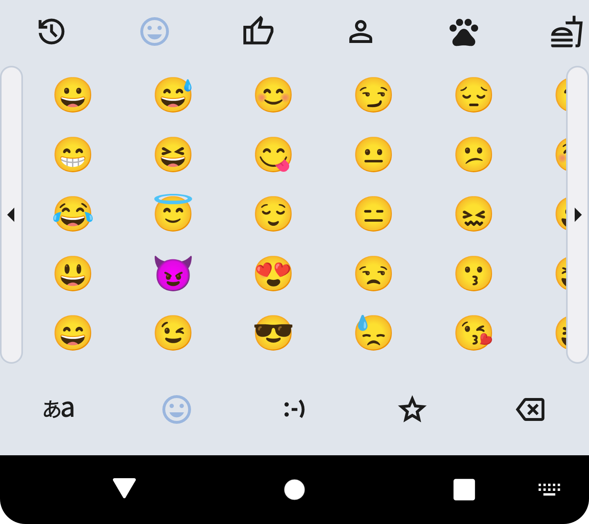
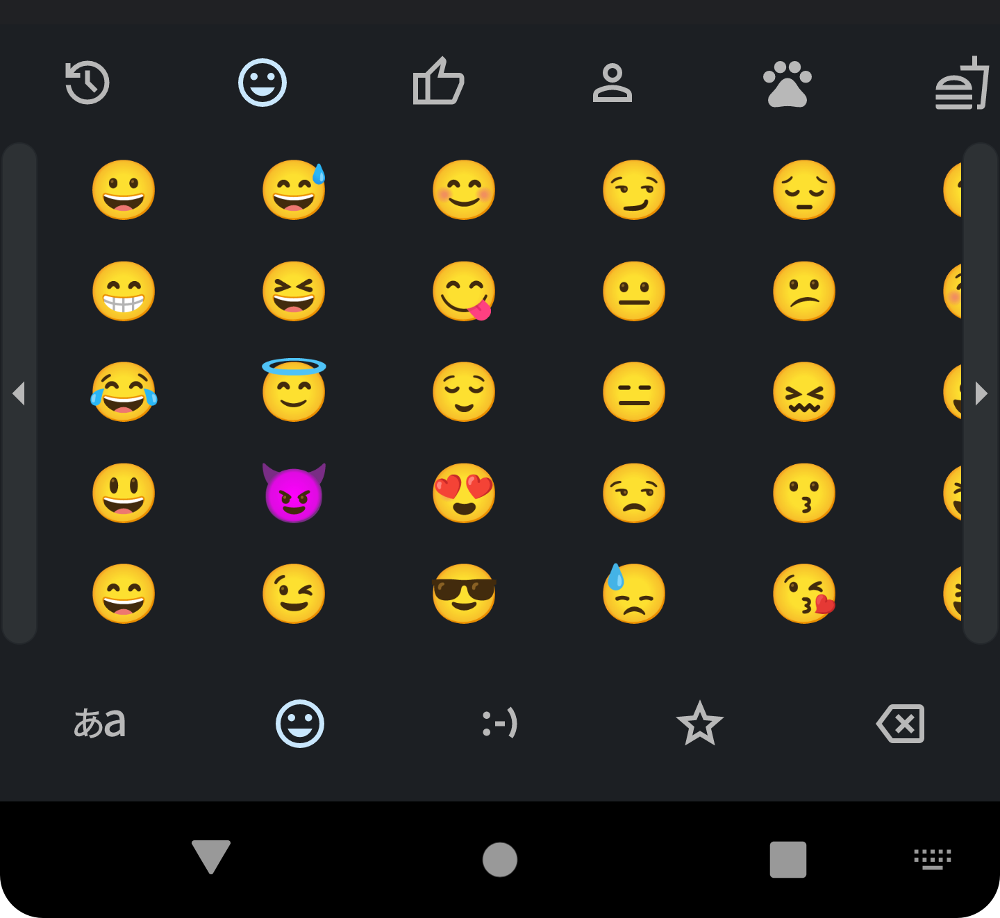

# Sumire (スミレ) — Offline Japanese Keyboard

<!-- SEO: offline japanese ime, privacy-first japanese keyboard, android ime, mozc dictionary, 日本語入力, Markdown キーボード, ユーザー辞書, スニペット, カスタムキーボード -->

<p align="center"></p>
<h3 align="center">100 % offline · 0 % data leak · 日本語入力をもっと自由に</h3>

[](https://play.google.com/store/apps/details?id=com.kazumaproject.markdownhelperkeyboard)
[](https://github.com/KazumaProject/JapaneseKeyboard/actions/workflows/android.yml)
[](https://github.com/KazumaProject/JapaneseKeyboard/releases)
[](LICENSE)


---

* [🗾 日本語](#日本語)
* [🌐 English](#english)

---

## 日本語

### 📑 目次

* [特徴](#特徴)
* [スクリーンショット](#スクリーンショット)
* [🚀 使い方 (ユーザー向け)](#使い方-ユーザー向け)
  * [ユーザー辞書](#ユーザー辞書)
  * [定型文スニペット](#定型文スニペット)
  * [カスタムキーボード](#カスタムキーボード)
* [🛠 ソースからビルド (開発者向け)](#ソースからビルド-開発者向け)
* [🏗 アーキテクチャ](#アーキテクチャ)
* [🔐 プライバシーとセキュリティ](#プライバシーとセキュリティ)
* [📝 謝辞](#謝辞)
* [📄 ライセンス](#ライセンス)

### 特徴

* **完全オフライン** — 機内モードでも動作、データは端末外へ一切送信されません。
* **ネットワーク権限ゼロ** — `AndroidManifest.xml` に `<uses-permission android:name="android.permission.INTERNET"/>` が存在しません。
* **mozc 辞書採用** — 豊富な語彙と高精度変換。
* **学習・予測変換** — 使用履歴を元に候補を最適化。
* **ユーザー辞書 (前方一部一致)** — 好きな単語・読みを登録。読みの「先頭部分」が一致した時点で候補に表示。
* **定型文スニペット** — `mail` → `my.long.email@example.com` のように、短い読みで長文を即展開。
* **カスタムキーボード** — キーのラベル・タップ文字・フリック方向ごとの出力を GUI で自由に編集。
* **複数入力モード** — 日本語・英語・記号をワンタップ切替。
* **高速・軽量** — Kotlin + Jetpack 最適化、フリック UI も滑らか。
* **テーマ切替** — ライト / ダーク。

### スクリーンショット

#### Smart Phone

<p align="center">
  
  
</p>

#### Tablet
<p align="center">
  
  
</p>

#### QWERTY
<p align="center">
  
  
</p>

#### Emoji
<p align="center">
  
  
</p>

---

### 🚀 使い方 (ユーザー向け)

1. 上記 Play Store バッジからインストール。
2. **設定 → システム → 言語と入力 → キーボード → スミレ** を有効化。
3. 入力欄を長押しして「スミレ」を選択。

#### ユーザー辞書

| 操作 | 説明 |
| ---- | ---- |
| 登録 | **ユーザー辞書** で「＋」をタップし、読みと単語を入力して保存。 |
| 動作 | 入力中、読みの *先頭* が一致した時点で候補に表示。<br/>例: `しら` と打つ → `知らない`（登録語）出現。 |
| 編集・削除 | 登録一覧を長押しで編集／右スワイプで削除。データは端末内 SQLite(R-Room) に保存。 |

#### 定型文スニペット

| 操作 | 説明 |
| ---- | ---- |
| 登録 | **定型文** から追加。短い「読み」と展開したい全文をセット。 |
| 使用例 | `mail` → `my.long.email@example.com`<br/>`sig` → `Your Nanme / Software Engineer` |
| ポイント | 読みを **完全一致** で打ち切ると即座に候補最上位に表示。長文でもワンタップ入力。 |

#### カスタムキーボード

| 機能 | 説明 |
| ---- | ---- |
| GUI エディタ | **カスタムキーボード** を選択すると、<br/>ラベル／タップ文字／フリック方向ごとの出力を視覚的に編集可能。 |
| 保存 | 編集後に「保存」をタップすると即時反映。設定は JSON で内部ストレージへ保存。 |

<details>
<summary>📦 APK を直接インストール</summary>

[リリースページ](https://github.com/KazumaProject/JapaneseKeyboard/releases)から apk をダウンロードし、端末へ転送後インストールしてください。提供元不明アプリの許可が必要です。
</details>

### 🛠 ソースからビルド (開発者向け)

| Tool           | Version           |
| -------------- | ----------------- |
| Android Studio | Hedgehog (2025.x) |
| Gradle Plugin  | 8.4               |
| JDK            | 21                |

```bash
# 1. clone
$ git clone https://github.com/KazumaProject/JapaneseKeyboard.git
$ cd JapaneseKeyboard

# 2. ビルド & インストール (USB デバッグ有効な実機orエミュレータ)
$ ./gradlew installDebug
