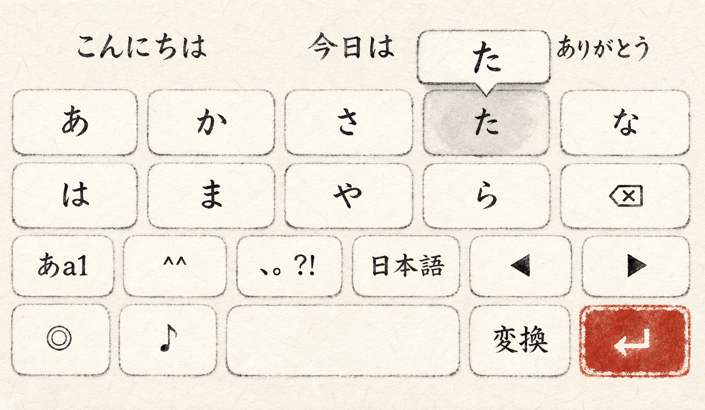

# 墨筆（半紙）キーボードスキン — Concept v1

Status: design review only. No keyboard implementation is included in this change.

## Visual direction

- The entire keyboard deck is a clean, warm-white sheet of Japanese hanshi paper.
- Key areas are separate pale paper patches with deckled fiber edges and broken dry-brush outlines.
- Labels use highly legible sumi brush strokes with visible pressure changes and restrained kasure.
- The pressed key receives a soft gray ink bloom; its popup is a slightly lifted paper tag.
- Vermilion is reserved for the action key, which is treated as a square hanko seal.
- Candidate text is written directly on the paper without glossy panels or decorative framing.

## Design tokens

| Role | Value |
| --- | --- |
| Deck paper | `#F6F1E4` |
| Key paper | `#FFFCF3` |
| Pressed ink wash | `#D8D2C7` |
| Sumi text | `#181512` |
| Diluted sumi | `#6E685E` |
| Vermilion action | `#B33A2E` |
| Action text | `#FFF9ED` |
| Key depth | Almost flat; hairline paper-lift shadow only |
| Key edge | Irregular dry-brush line with small gaps |

## Interaction direction

- Press: a controlled ink bloom expands from the touch point while the key moves down very slightly.
- Release: the bloom fades like ink being absorbed into paper; no elastic or glossy animation.
- Popup: a paper tag rises above the pressed key with a small folded pointer.
- Action key: becomes a darker vermilion when pressed instead of showing a gray ink bloom.

## Deliberate exclusions

- No seigaiha or other repeating Japanese pattern.
- No navy background, gold decoration, aged parchment, wood, or scroll motifs.
- No plastic keycaps, glass effects, strong shadows, or uncontrolled ink splashes.
- This must remain visually distinct from the existing blue-and-cream Washi skin.
