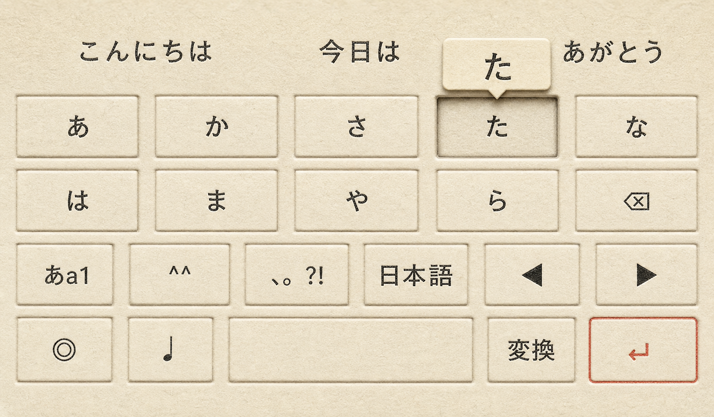
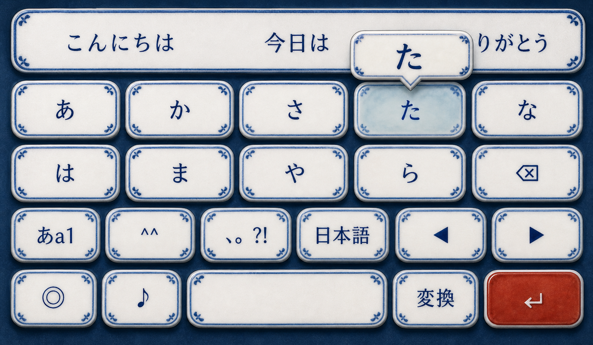
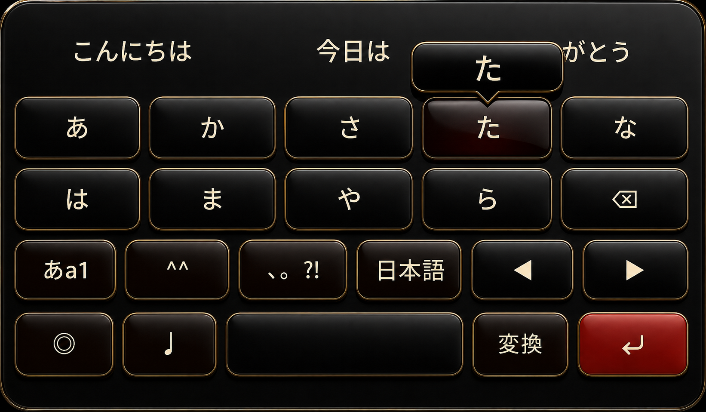
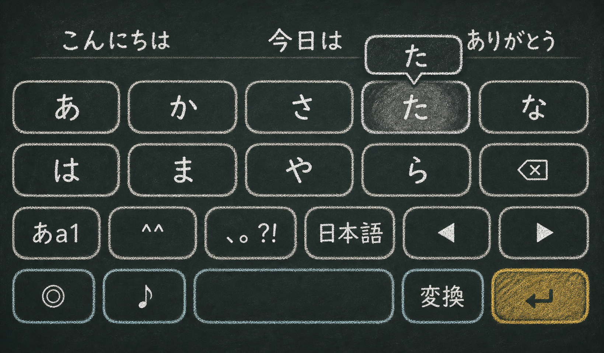
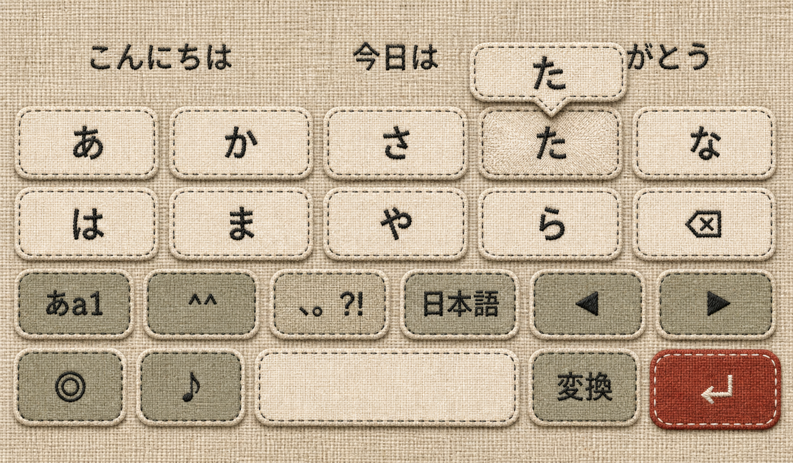
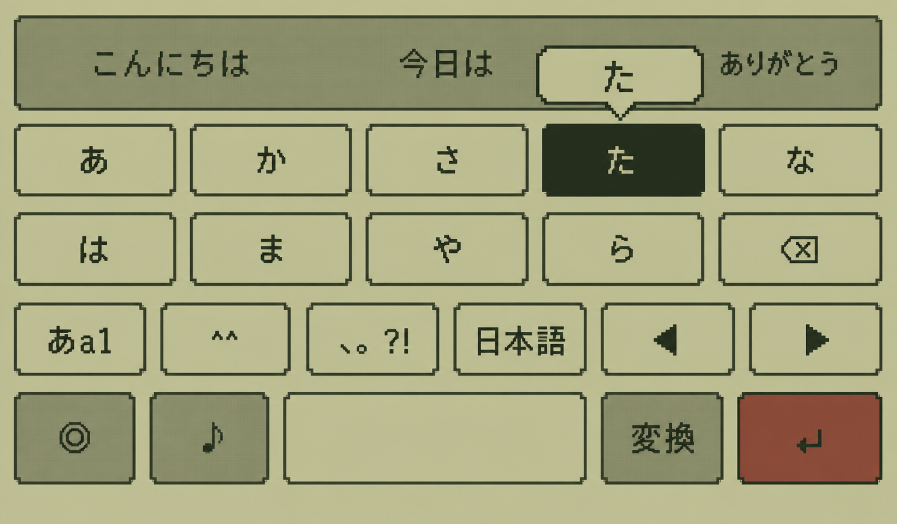

# キーボードスキン デザインカタログ — v1

Status: design exploration only. No keyboard implementation is included.

## 方針

スキンは既存のカラーテーマから完全に独立させる。色だけを替えた案は採用せず、次の5点のうち最低3点が既存スキンと異なる案だけを残す。

1. キーの輪郭と立体構造
2. デッキとキーの素材
3. 文字の作法
4. 押下・ポップアップの反応
5. 候補欄とアクションキーの扱い

既存の Default / Flat / Glass / Neumorphism / Mechanical / Washi / Neon / Terminal / Cupertino、および新規の「墨筆（半紙）」とは視覚言語を重複させない。

## 今回ビジュアル化する6案

| ID | 名称 | 一目で分かる特徴 | 押下表現 | 可読性 | 実装規模 |
| --- | --- | --- | --- | --- | --- |
| 01 | 活版印刷 | 厚紙への凹版、組版の精密さ | 文字と枠が紙へ深く沈む | 高 | 中 |
| 02 | 染付磁器 | 白磁タイルと呉須の青 | 釉薬の青が中央へ溜まる | 高 | 中〜高 |
| 03 | 漆塗り | 黒漆、朱漆、細い金縁 | 反射が締まり朱が覗く | 高 | 中〜高 |
| 04 | 黒板チョーク | 石板と手描きの粉線 | チョーク粉が円状に広がる | 高 | 低〜中 |
| 05 | リネン刺繍 | 麻布パッチと縫い目 | 布がへこみ縫い目が張る | 高 | 中 |
| 06 | モノクロ液晶 | オリーブLCDとピクセル文字 | セグメントが反転する | 中〜高 | 低〜中 |

## 01 活版印刷

- デッキは生成りの厚いコットン紙。繊維は細かく、墨筆の半紙より密度が高い。
- キーは別部品ではなく、紙に正確に空押しされた矩形。角は小さく、罫線は版圧で暗くなる。
- 文字は明朝系の活字。筆のかすれではなく、インク量のわずかな不均一だけを出す。
- 候補欄は校正紙、決定キーは赤い校正印として扱う。
- 色: Paper `#E8DDC4`, Key `#F3EAD7`, Ink `#201C17`, Rule `#6F6558`, Proof red `#B33B2E`。

## 02 染付磁器

- 白磁の薄いタイルを、落ち着いた藍色の陶板へ並べる。
- 各キーは乳白色の釉薬、縁だけに細い呉須の手描き線。装飾文様は角へ限定する。
- 文字は濃い藍の焼付け。アクションキーだけ辰砂風の赤磁器。
- 押下時はキー中央へ青い釉薬が少し溜まるように見せる。
- 色: Deck `#24384A`, Porcelain `#F7F3E8`, Cobalt `#244F7A`, Pale blue `#AFC2C8`, Cinnabar `#A94738`。

## 03 漆塗り

- 炭黒の漆デッキに、わずかに膨らんだ黒漆のキーを置く。
- ラベルは金ではなく読みやすい象牙色を主役とし、細い金線は輪郭だけに使う。
- 修飾キーは溜塗り、決定キーは深い朱漆。派手な蒔絵や和柄は入れない。
- 押下時は反射ハイライトが細くなり、黒の奥から朱がわずかに透ける。
- 色: Deck `#0D0C0B`, Key `#1B1715`, Ivory `#F1E7D1`, Gold edge `#B99A58`, Vermilion `#A92D22`。

## 04 黒板チョーク

- 深緑を含む無光沢の石板。キーは塗り分けず、二重になったチョーク罫線だけで区切る。
- 文字は均一なUIフォントではなく、読みやすさを保った手書きチョーク。
- 候補欄には薄い横線、決定キーには黄土色のチョークを使う。
- 押下時は粉が指先から円状にぼけ、離すと薄い跡だけ残して消える。
- 色: Slate `#202725`, Chalk `#F0EBDD`, Dust `#9EA39A`, Blue chalk `#8FB8B2`, Ochre `#D5AA4D`。

## 05 リネン刺繍

- デッキは粗めの生成り麻布。キーは薄い麻布パッチを縫い付けた構造。
- 文字は濃い木炭色の刺繍糸。輪郭は少し不揃いな返し縫いで表現する。
- 修飾キーだけ灰緑、決定キーだけ錆朱の布を使い、色数を抑える。
- 押下時は布が中央へへこみ、縫い目がわずかに張る。ポップアップは縫い付けタグ。
- 色: Linen `#D7C6A8`, Patch `#EFE5D0`, Thread `#2A2926`, Moss `#6F7659`, Rust `#9F443B`。

## 06 モノクロ液晶

- 1990年代の携帯電子機器を思わせるオリーブ色の反射型LCD。
- キー境界は1px相当の濃緑ピクセル。角は階段状で、影や光沢を使わない。
- 文字は可読性を優先したピクセルかな。候補欄はステータス表示領域として一段濃くする。
- 押下時は背景と文字を完全反転し、ポップアップもピクセル枠だけで表示する。
- 色: LCD `#B5B58B`, Key `#C6C79D`, Pixel `#273126`, Mid `#59604B`, Accent `#7D493B`。

## 次点の6案

| ID | 名称 | 素材・構造 | 固有の反応 |
| --- | --- | --- | --- |
| 07 | 粘土スタンプ | 手で成形した淡色クレイに文字を刻印 | 指の圧痕が一瞬残る |
| 08 | 折り紙ファセット | 一枚の紙を幾何学的に折った面 | 押した面だけ折り目が反転 |
| 09 | 禅石庭 | 細砂のデッキと滑らかな小石キー | 押下点から砂紋が一周広がる |
| 10 | 真鍮計器 | ヘアライン真鍮、琺瑯ラベル、目盛り | 小さな指針がキー方向へ振れる |
| 11 | ジェリーポップ | 半透明ではなく拡散する柔らかなゲル | キーが潰れ、隣接面へ弾性波が伝わる |
| 12 | 切り紙コラージュ | 色紙の切断面と重なりでキーを構成 | 押した紙片が一層下へ滑る |

## 拡張候補12案

13. リソグラフ — 2色の版ずれと網点。押下時だけ版が正位置へ揃う。
14. 琺瑯サイン — 白い琺瑯板、濃紺の縁、欠けた部分に鉄色が覗く。
15. レザークラフト — 植物タンニン革、刻印文字、手縫いの周囲線。
16. 石材象嵌 — 明るい石板へ暗色の文字と輪郭を埋め込む。
17. バウハウス — 円・矩形・三角の構成でキー役割そのものを形分けする。
18. 漫画スクリーントーン — 白黒網点、集中線、押下ポップアップは吹き出し。
19. 水彩庭園 — 余白を主役にした淡い顔料層。押下時だけ色が濃くなる。
20. 実験計器盤 — 白い計器筐体、細い目盛り、状態灯で役割を示す。
21. カセットシンセ — クリーム筐体、物理スイッチ、橙と青緑の機能色。
22. 押し花樹脂 — 読み取りを邪魔しない位置に小さな植物片を封入する。
23. コルクボード — コルク面、紙ラベル、色付き画鋲を機能インジケータにする。
24. 雪氷マット — 霜ガラスではなく圧雪の粒子と足跡のような押下跡で構成する。

## 採用判定

実装候補へ進める条件は、実機で1秒見ただけで名称を当てられること、かな文字のコントラストを落とさないこと、押下状態が静止画でも判別できること、既存テーマ色が混ざってもスキンの印象が変わらないことの4点とする。
