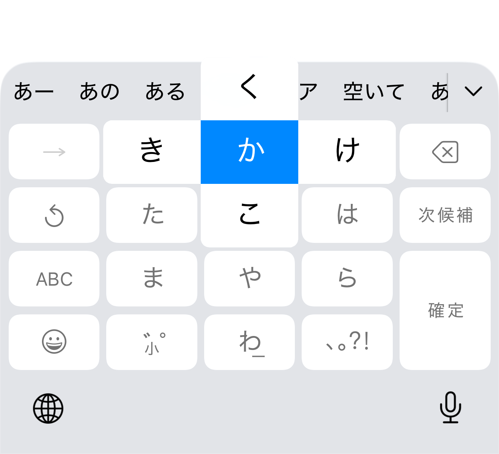
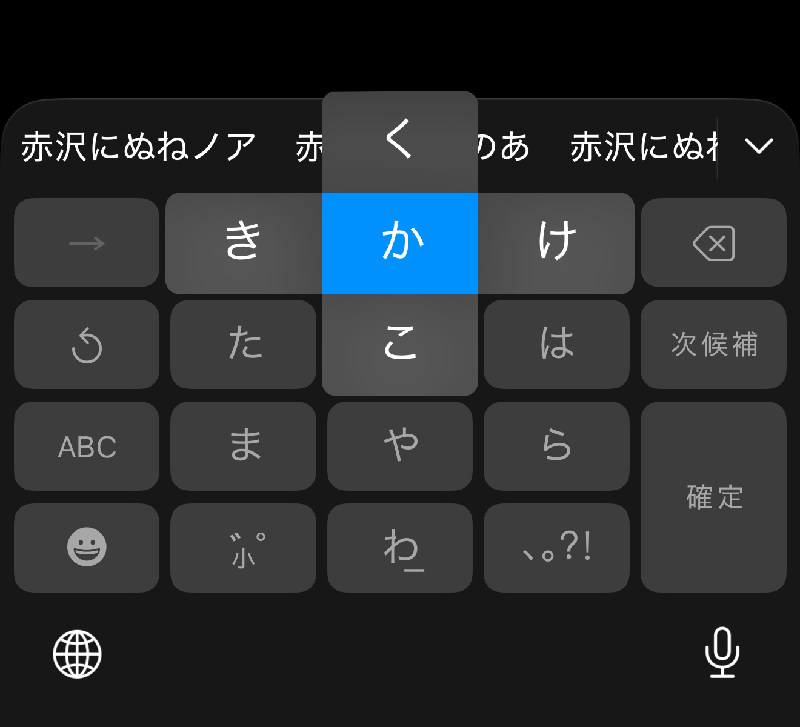
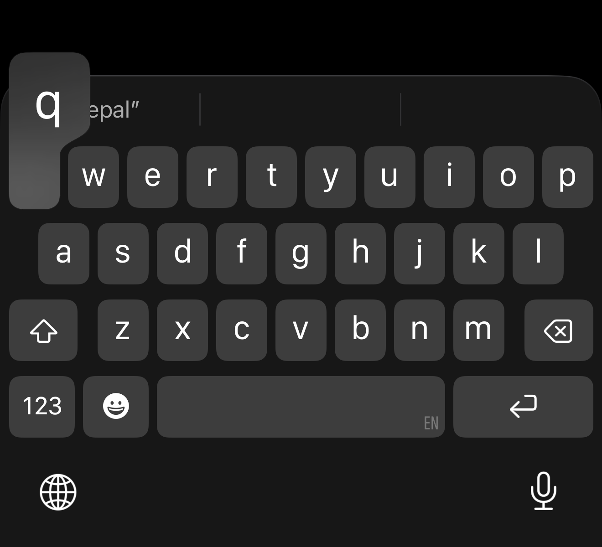
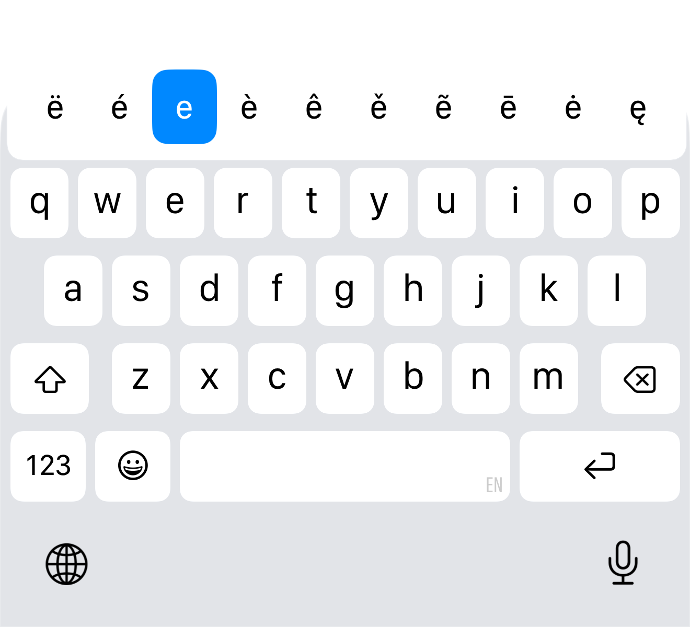

> 更新: デフォルトの高さ計算に対する無条件の補正を取り消しました。
> 以下の旧レイアウト測定値を最新版の合格根拠には使用しません。
> 現在の修正範囲は [ime-layout.md](ime-layout.md)、実機結果は
> [device-regression.md](device-regression.md) を参照してください。

# 着せ替え / Keyboard skins

## 状態 / Status

**既存フォントを維持します（2026-09-08 の依頼者指定）。字形の一致は受け入れ条件から除外し、文字サイズ・位置とアニメーションは引き続き検証対象です。**
Default、Cupertino Light、Cupertino Dark の切替、描画の分離、保存値の復元を実装しました。
静止画22ケースと動作48試行は、明示した比較基準をすべて通過しました。候補欄とナビゲーション領域の不具合も修正・検証済みです。全端末・全設定でのピクセル一致を意味するものではありません。

**Retain existing fonts per the requester on 2026-09-08. Glyph identity is out of scope; text size, placement and animation remain in scope.** Skin selection and the
presentation integration are implemented. All 22 static cases and 48 motion trials meet the documented tolerances; candidate/inset fixes pass actual-IME tests. This is not universal pixel identity.

## 参照条件 / Reference conditions

- Base: `dev`, `bbdc7414746adeffc815d5158631e415a1167007`.
- iPhone 17 Pro Max simulator, iOS 26.4.1 (23E254a), 1320 × 2868 pixels,
  440 × 956 logical points, scale 3.
- Dedicated simulator: `KeyboardSkinReference`,
  `F12E79DA-7D73-42BB-BE94-69FE135B72A9`.
- Xcode 26.6 (17F113); build SDK iOS 26.5. The **runtime**, not the SDK, defines the reference.
- Standard UIKit `UITextField`, default keyboard traits; Japanese Kana and English (US).
  Appearance is explicitly Light or Dark; the reference app uses public UIKit. A separate macOS-only CoreSimulator diagnostic captures direct display timestamps.
- Static capture date: 2026-09-07; final direct motion capture: 2026-09-08. Successful XCUITest runs: `configure-us`,
  `kana-gestures`, `reference-matrix` (kana evidence only), `english-reference`.
- English images from the first `reference-matrix` run are excluded: an onboarding
  sheet covered the keyboard. `english-reference` dismisses it and checks hittability.
- PNG stills are lossless. H.264 recordings are used for observing sequence only,
  **never** for sampling colors. One-second delayed captures occur inside long holds;
  they do not provide synchronized touch-to-frame latency measurements.

## 実測値 / Measurements

| Surface | Light | Dark |
| --- | --- | --- |
| Keyboard background | `#E2E4E8` | `#171717` |
| Normal / special key | `#FFFFFF` | `#3D3D3D` |
| Kana guide selected cell | `#0088FF` | `#0091FF` |
| Pressed origin (representative interior sample) | `#E7E8EC` | `#262626` |
| Dimmed kana guide labels | `#737373` | `#545454` |

Kana あ hit rectangle is x=90.7, y=662, w=86.3, h=56 pt. Its visible surface
is sampled at x=281, y=1995, w=241, h=147 **pixels**, without resizing.

The standalone Android fixture uses the same surface dimensions and density 3,
separately from the actual IME layout. On the connected Pixel 6 / Android 17,
opaque sample RGB error is **0** for both appearances. Upper-left corner maximum
error is **1.0 pt** for each appearance after calibration (mean 0.324 pt light,
0.269 pt dark). See [machine-readable measurements](evidence/surface-comparison.json)
and [comparison script](../../tools/keyboard-skins/compare-surfaces.py).

This checks a 12 pt corner contour, not the whole key, text, keyboard or popup.
The mask uses RGB tolerance 2 for the reference and alpha >=253 for Android;
antialiasing and the dark background affect the boundary. It is not a whole-image
MAE score and must not be presented as whole-keyboard acceptance.






## 実装 / Implementation

- `KeyboardSkinId`: stable persisted identifiers; absent/unknown identifiers resolve
  to Default without deleting saved values.
- `KeyboardSkinRegistry`: returns the renderer for each skin. Default returns null,
  delegating to the existing visual implementation. Add future renderers here.
- `KeyboardSkin`: owns keyboard/key/popup drawables and presentation-motion hooks.
  Key drawables have independent constant-state instances; changing one key's pressed
  state cannot change another key.
- `ImePreferencesSnapshot.withKeyboardSkinAppearance()`: derives effective colors,
  border, alpha and touch-effect settings from the saved snapshot. It never persists
  overrides. Candidate column counts, dimensions, thresholds and input settings are
  unchanged. Images/videos are suppressed through the existing cleanup/request-id path.
- Tenkey, gojuon, QWERTY, custom layouts and symbol keyboard receive the skin identifier.
  Normal/floating IME configuration paths share these entry points.
- Popups carry `skinId` through style normalization. Kana uses separate cross cells
  and directional pointers; QWERTY uses a cap/neck/stem preview and flat selected cells.
  Custom circular/TFBi guides retain their selections and content, using skin surfaces.
  Those layouts have no native iOS equivalent and are adaptations.
- Default motion remains untouched. Cupertino removes Material ripple/elevation animation,
  updates visible flick windows in place, and holds released QWERTY windows for 34 ms
  while committing immediately. Timing is measured separately in the follow-up evidence.
- Skin selection disables competing controls in the theme screen without clearing
  them. Input-composition color controls remain independent.

## 全ポップアップと動作の追試 / Full-popup and motion follow-up

The follow-up compares lossless iOS captures with native Android production drawables,
including the whole cap, neck, stem, directional arrow, guide cross, and placed glyphs.
Reference and Android images are aligned by their key anchors only: there is no image
rescaling or best-fit registration. Results are in [fidelity evidence](evidence/fidelity/README.md).
The isolated fixture pins density to 3 and font scale to 1; the actual-view motion host
uses density 420 / font scale 1.3; final timing is measured on the hardware-rendered API 35 emulator. Those are different tests.

- QWERTY long-press variations retain **three columns, character order, window dimensions,
  offsets and hit mapping**. The iOS single row is intentionally not adopted. Candidate
  settings and long-press input thresholds are unchanged.
- Cupertino QWERTY release holds affect the window only. Input ownership and text commits
  end on UP. Kana guides dismiss immediately, independently of surrounding-label fades.
  New gestures, CANCEL, skin switches, hiding and detach clear retained presentations.
- Final motion uses direct CoreSimulator callback timestamps and Android screenrecord's
  embedded Winscope display timestamps, converted per input event. All 48 trials / 84
  milestones pass the one-60-Hz-frame criterion; maximum difference is 15.001 ms rounded
  upward. Source brackets remain available in the reports. This replaces the earlier
  uncertain PTS-to-marker regression.
- Existing platform fonts are retained, with no bundled font data or glyph-outline changes.
  Per the requester on 2026-09-08, glyph-mask identity is diagnostic only and is not an
  acceptance gate. Text size, baseline and placement remain calibration targets. Previously
  recorded masks and bounds are preserved without rewriting measured values.

### 再現の限界 / Acceptance limits

The finite portrait reference matrix is not proof of identical rendering at every
keyboard width, system font setting, orientation, underlying app background or OS release.
The dark material fields approximate the captured lighting; they do not implement iOS's
compositor. Existing Android layout/selection behavior is deliberately preserved.
The final finite matrix passes its declared tolerances. Glyph differences are outside the agreed scope. Full reproduction at every OS release, backdrop or user dimension is not inferred from these results.

## 検証 / Validation

Commands use JDK from Android Studio and the local Android SDK:

```sh
./gradlew :core:testDebugUnitTest :custom_keyboard:testDebugUnitTest \
  :tenkey:testDebugUnitTest :qwerty_keyboard:testDebugUnitTest :gojuon_keyboard:testDebugUnitTest
./gradlew :app:testLiteStandardDebugUnitTest --tests '*KeyboardSkin*' \
  --tests '*Theme*' --tests '*KeyboardGuide*' --tests '*KeyboardDisplayResolver*'
./gradlew :app:assembleLiteStandardDebug
./gradlew :core:connectedDebugAndroidTest \
  -Pandroid.testInstrumentationRunnerArguments.class=com.kazumaproject.core.KeyboardSkinDeviceRenderTest
python3 tools/keyboard-skins/compare-surfaces.py
```

Use `-Pkotlin.compiler.execution.strategy=in-process` if the local Kotlin daemon
cannot connect. The device fixture installs only the core instrumentation package;
it does not install/select the user's IME or change keyboard settings.

## 候補欄とシステム領域 / Candidate strip and navigation

候補欄の設定高さからナビゲーション padding が差し引かれる計算を修正し、
着せ替え変更時の配色更新とデフォルト色の復元を追加しました。
実際の IME で3種類の表示状態・着せ替え往復・縦横画面・ナビゲーション方式を検証しています。
See [root causes, fixes and actual-IME evidence](ime-layout.md).
