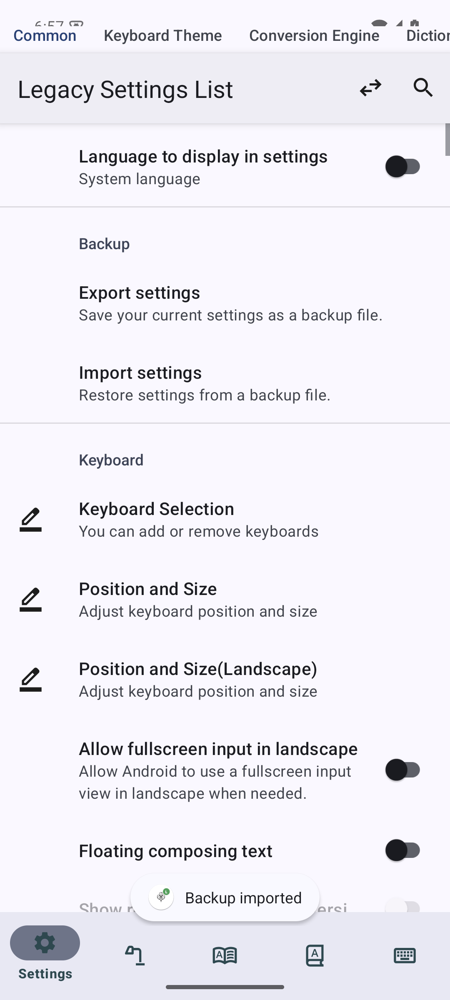
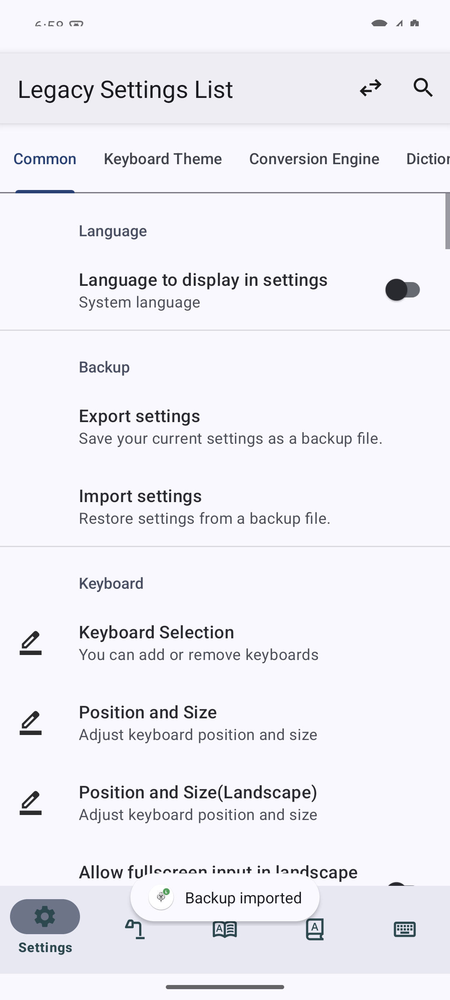

# バックアップ復元後の設定カテゴリの位置ずれ

## ブランチと変更

`origin/dev` (`75fa7423c`) 起点の専用worktree・`codex/fix-backup-category-insets` で作業し、PR #1122 の `e1fad8828` をマージした。Stack PR の base は `codex/fix-settings-loading-freeze`。

`MainActivity` は起動時に一度だけ content root を取り付け、その root で Insets を受信・消費する。初期化後は内側の FrameLayout に設定画面を追加する。読み込み画面に届いた余白を保持し、設定画面との二重適用を防ぐ。設定キー、JSON 形式、公開 API は変更していない。

## 原因と再現

バックアップ読込は `CommonPreferenceFragment` の実際の ActivityResult callback で JSON を適用し、フォントをリセット・設定を移行した後に `Activity.recreate()` を呼ぶ。PR #1122 は初期化前に読み込み用 View を `setContentView()` で表示し、初期化後に別の root に差し替えていた。

依存している AppCompat 1.7.1 の `ActionBarOverlayLayout.onMeasure()` は、ActionBar 分を足した inner Insets をキャッシュし、値が変わった場合だけ ContentFrameLayout へ配信する。二度目の `setContentView()` は同じ ContentFrameLayout の子だけを交換するため、キャッシュ済みの余白が新しい設定 root に届かない。子からの `requestApplyInsets()` でも同じ値の配信は保証されない。

API 35 / arm64 の `emulator-5580`（1080×2400）で、修正前の通常起動・旧ホームへの切替でもカテゴリタブが y=0、ActionBar 下端が y=296 になる画面を確認した。DocumentsUI の保存・選択画面を実際に操作したバックアップ出力・読込も実施したが、通常の再作成ではウィンドウ側の余白が復元され、読込後の症状が隠れる場合があった。

回帰テストは実際のバックアップ Preference のクリックリスナーを実行し、Instrumentation の ActivityMonitor で CreateDocument / OpenDocument の結果 URI を返す。テスト専用の Java ContentProvider に出力した JSON をそのまま読み込み、変更したホーム設定が復元されることも検証する。JSON 適用、フォントリセット、移行、Activity 再作成は製品コードを通す。

既存の初期化 gate を使い、読み込み画面のレイアウトと Insets 配信が終わるまで初期化を保留する。起動時のテストはウィンドウ flags を変更しない。復元テストでは通常の saved-window 状態に加え、stable / fullscreen / hide-navigation の layout flags を設定し、ActionBar 位置を Insets で確保する経路を制御実験として検証する。この flags 設定はテスト内だけで行う。

| 条件 | #1122 の未修正コード | 修正後 |
| --- | --- | --- |
| 初期化を保留した旧ホーム起動 | タブ上端 0 / ActionBar 下端 296 | タブ上端 296 / ActionBar 下端 296 |
| 通常の saved-window 状態でバックアップ復元 | タブ上端 296 / ActionBar 下端 296 | タブ上端 296 / ActionBar 下端 296 |
| stable layout flags でバックアップ復元 | タブ上端 0 / ActionBar 下端 296 | タブ上端 296 / ActionBar 下端 296 |

修正前の診断では、loading 中にキャッシュされた Insets の top が 296 にもかかわらず、差し替え後の root padding が 0 になっていた。修正後は固定 root の padding 296 が保持され、設定 root の padding は 0 のままタブが正しい位置に収まる。





## 検証記録

- 最終版の回帰テストを #1122 の製品コードに戻して実行: 3 件中 2 件が上記の座標不一致で失敗。[ログ](backup-category-insets-evidence/lite-baseline-final.log)
- 修正前の Insets・View 階層の診断: [ログ](backup-category-insets-evidence/lite-baseline.log)
- Lite / Full Standard Debug の app・androidTest ビルド成功。
- 設定関連の JVM テスト: Lite 165 件、Full 165 件、全成功。
- API 35 の端末 suite: Lite 28 件（27 成功、Full 専用 Gemma 1 件 skip）、Full 28 件（全成功）。[Lite](backup-category-insets-evidence/lite-fixed.log) / [Full](backup-category-insets-evidence/full-fixed.log)
- Preference の描画完了まで待つ最終版の新規テストを再実行: Lite / Full 各 3 件、全成功。[Lite](backup-category-insets-evidence/lite-fixed-focused.log) / [Full](backup-category-insets-evidence/full-fixed-focused.log)
- 修正後 Full の DocumentsUI で実際に設定を出力し、同じ JSON を選択して読み込み直した後もタブ上端 296 / ActionBar 下端 296。[座標・操作記録](backup-category-insets-evidence/full-fixed-manual.json) / [画面](backup-category-insets-evidence/full-fixed-manual.png)
- `git diff --check` 成功。作業開始時の enabled/default IME への復帰も確認済み。

PR #1122 で元の dev でも global-idle 待機が終わらないと確認された `candidatePreviewsKeepNavigationHiddenAcrossRecreationAndRestoreItOnReturn` は、同じ理由で端末 suite から除外する。API 28 以下専用テストは API 35 では対象外。Lite では Full 専用の Gemma テストが skip される。

通常アプリの設定と既定 IME は変更せず、検証用 `.freezeprobe` パッケージを使用した。追加で有効化した検証用 IME は作業終了時に無効化し、作業開始時の enabled/default IME と一致することを確認した。

## 再実行

```sh
git submodule update --init --recursive
./gradlew -I investigation/probe.init.gradle \
  :app:assembleLiteStandardDebug :app:assembleLiteStandardDebugAndroidTest \
  :app:assembleFullStandardDebug :app:assembleFullStandardDebugAndroidTest
python3 investigation/run_backup_category_insets_checks.py --serial emulator-5580
```

`--edition lite --focused` は新規 3 件のみを実行する。全 suite はバックアップ、初期化待機、複数回の再作成、検索・全タブ読込、失敗と再試行、新旧ホーム切替、Intent、バックスタック、独自 Toolbar からの復帰、下部ナビゲーションを検証する。Provider authority が固定のため、実行器は他方の edition の `.freezeprobe.test` APK を外してからテスト APK をインストールする。通常アプリ・既定 IME は切り替えない。
