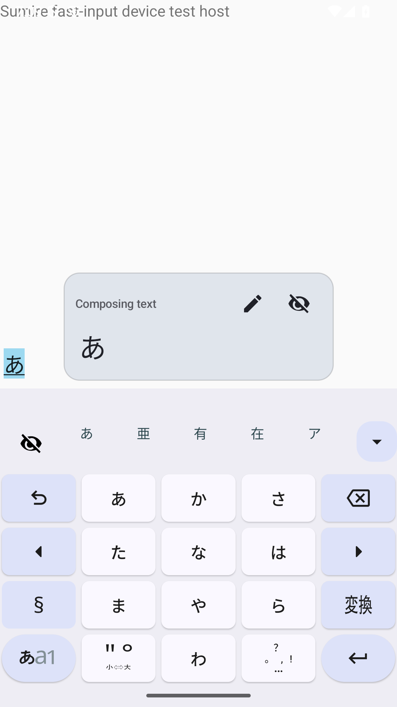
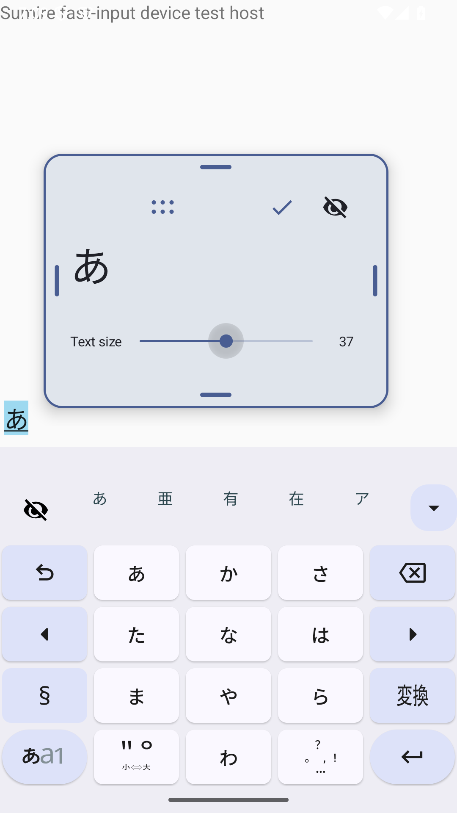

# 未確定文字のフロートガイド

通常のソフトウェアキーボード専用。新設定の「キーボード表示」と従来設定に同じスイッチを追加し、初期値はOFF。

- 通常時は未確定文字と編集・非表示アイコンを表示する。移動・リサイズはロックする。
- 編集アイコンで編集モードに入る。上部のドット状ハンドルで移動し、4辺のハンドルで枠を変更する。チェックアイコンで編集を終了する。
- 1本指では触れた辺を変更し、反対辺を固定する。2本指では別々の辺を同時に変更できる。隣接辺・対向辺の双方に対応し、指の追加・解除時は基準を更新する。
- 編集中のスライダーで文字サイズを18〜56spに変更する。初期値28sp。
- 初期枠280×112dp、キーボード直上の中央。編集用の追加領域96dpは保存する枠の高さに含めない。
- 位置と枠サイズを縦横別に、文字サイズを共通で保存する。
- ガイド内の非表示アイコンと、ショートカットの表示／非表示アイコンは同じ状態を切り替える。非表示は入力再開後も維持し、明示的な再表示まで保持する。機能の有効設定とは別に保存する。
- ショートカットは機能が利用可能な場合に自動追加する。候補表示中、候補一覧の展開中、通常のショートカットバーがOFFの場合も再表示できる。
- 未入力・確定後は説明文を表示し、入力前にも配置を編集できる。
- 物理キーボード接続時、既存floatingモード、パスワード欄、全画面抽出表示、レイアウト編集中は非表示。
- 画面が縮小した場合、保存値を上書きせず表示可能範囲へ補正する。200×96dp未満では一時非表示、編集用に200×192dpを確保できない場合は編集を無効にする。

## 描画と既存機能との分離

`ComposingGuideController`がIMEトークンに属する`TYPE_APPLICATION_PANEL`を管理する。フォーカスを取得せず、ガイド外のタッチを背後へ通す。通常キーボードのView階層・`onComputeInsets()`・画面押し上げ処理は変更しない。追加のオーバーレイ権限は不要。

物理キーボード用候補ウィンドウと既存floatingキーボードは流用しない。既存の未確定文字送信が成功した後で表示を更新し、送信文字列や変換処理は変更しない。カーソル追従・カーソル更新要求は追加しない。

SharedPreferencesの`composing_guide_*`キーに保存するため既存の設定バックアップ対象になる。リセット操作は縦横の配置・寸法と文字サイズを戻し、有効状態と手動の非表示状態は維持する。

## レビュー

- 候補一覧にアイコンが追加されても、候補クリックには元の候補インデックスを渡すことを回帰テストで確認。
- 通常のショートカットバーを無効にしている場合と候補表示中の再表示経路を追加。
- 展開した候補一覧にもショートカットのクリック処理を接続し、操作テストを追加。
- アクセシビリティから文字サイズを変更した場合の保存漏れを修正。
- 通常モードのドラッグ無効、操作中断時のキャンセル、最小寸法、画面端、指IDの保持を確認。

## 検証結果

- Lite Standard Debugおよびinstrumentation APKのビルド成功。
- 関連単体テスト98件成功（13スイート、失敗・エラー0件）。
- Android 15 / API 35、Android 7.0 / API 24の専用エミューレータで操作テスト成功。
- ガイド表示前後でキーボードと入力欄の領域が不変、通常時の位置ロック、編集モードの移動・4辺の1本指操作・隣接辺/対向辺の2本指操作、文字サイズ保存を確認。
- 入力再開後の配置復元と非表示状態の保持、候補表示中・候補展開中のショートカットからの再表示を確認。
- 設定OFF、既存floatingモード、パスワード欄での非表示、通常モードへの復帰、WebView入力、ガイド外のボタン操作を確認。
- 実機は使用していない。回転・分割画面の端末操作、物理キーボードの実接続は未検証。縦横別保存・表示範囲縮小・表示対象条件は単体テストで確認。

| 通常表示 | 編集表示 |
| --- | --- |
|  |  |

## 再実行

専用のアプリIDでビルドし、実機を使用せず専用エミューレータにのみインストールする。エミューレータは物理キーボード接続なし（hw.keyboard=no）で起動する。

```sh
ANDROID_HOME=/Users/kazuma/Library/Android/sdk ./gradlew \
  -I investigation/composing-guide.init.gradle \
  :app:assembleLiteStandardDebug :app:assembleLiteStandardDebugAndroidTest \
  :app:testLiteStandardDebugUnitTest \
  --tests '*composing_guide.*' \
  --tests '*ShortcutActiveStateResolverTest' \
  --tests '*ShortcutToolbarPresentationPolicyTest' \
  --tests '*SuggestionAdapterShortcutEntryClickTest' \
  --tests '*CandidateStripPresentationPolicyTest' \
  --tests '*ComposingTextArbiterTest' \
  --tests '*KeyboardDisplayResolverTest' \
  --tests '*KeyboardLayoutEditStateTest' \
  --tests '*FloatingCandidateConversionCancelReducerTest'

# 専用エミューレータのserialを明示する（例: emulator-5558）
adb -s emulator-5558 install -r app/build/outputs/apk/liteStandard/debug/app-lite-standard-debug.apk
adb -s emulator-5558 install -r app/build/outputs/apk/androidTest/liteStandard/debug/app-lite-standard-debug-androidTest.apk
adb -s emulator-5558 shell am instrument -w \
  -e class com.kazumaproject.markdownhelperkeyboard.ComposingGuideDeviceTest \
  com.kazumaproject.composingguidetest.lite.test/androidx.test.runner.AndroidJUnitRunner
```

操作テストは画面座標へタッチを注入し、保存値とキーボード・入力欄の座標を確認する。移動後のIME子ウィンドウではアクセシビリティの可視情報が遅れて更新される場合があるため、ガイド内の要素は画面内座標と実タッチによる状態変化でも検証する。
