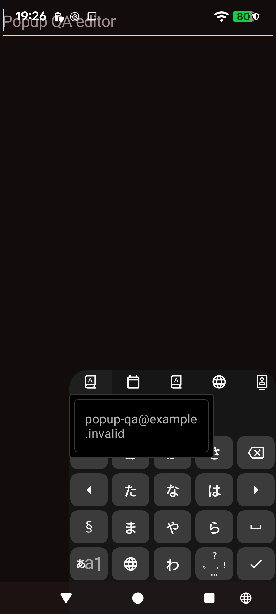
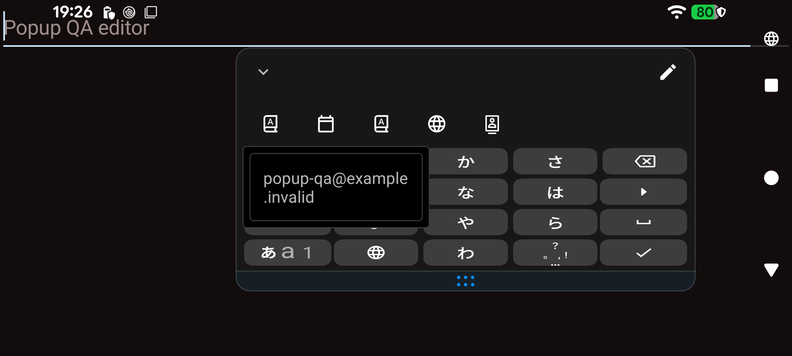
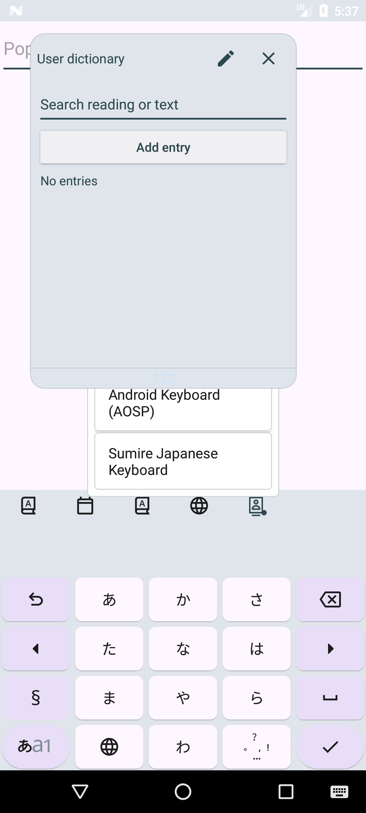
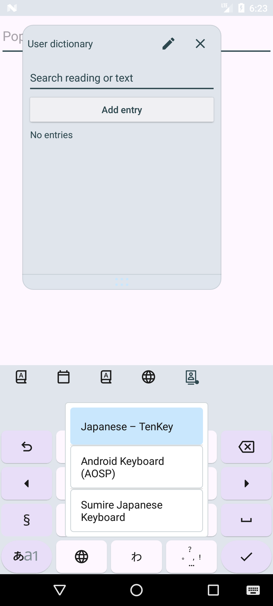

# IME popup placement and scrolling validation

Base: origin/dev at `17f7e9689f3f095cf62b926672410bc0ab207b27`, independently branched from the same commit as the Tenkey sizing PR.

## Cause and change

PR #1106 replaced the previous keyboard/toolbar placement with a screen-centered full-screen selection window and removed the compact list-height limit for templates and macros. The full-screen outside-tap shield remains; the list panel now uses an independent placement policy.

- Keyboard selection centers in the visible keyboard/candidate/toolbar region. A floating keyboard uses its displayed root.
- Templates and dates use the visible shortcut toolbar, or the candidate strip when shortcuts are integrated, as their dropdown anchor.
- Keyboard/templates/date menus show at most five measured rows; macros retain eight. Rows are measured at the actual list width, and height is capped by the available viewport. Overflow scrolls with a visible scrollbar.
- Non-focusable display, Back handling, asynchronous request invalidation and input-connection management remain in place.
- API 24–28 use PopupWindow's former layout-in-screen flag so outside taps cover the same screen region as API 29+.

Dictionary panels can expand the otherwise transparent IME host to full screen. Centering in that host obscured the selection list behind the dictionary panel on API 24. The keyboard placement uses the union of the visible keyboard/candidate/toolbar views, instead of the expanded host. Device testing also exposed an API 24 decor pan: the correctly placed list was moved upwards after layout when dictionary search owned the local input connection. `SOFT_INPUT_ADJUST_NOTHING` prevents this second movement. The captured list can now be tapped and dictionary-local text insertion succeeds.

## Comparison

The position tests compare the panel's center with the reference keyboard center (1 px tolerance), the dropdown top with the toolbar bottom, and expanded-host placement with visible content bounds. These restore the placement semantics of the pre-#1106 Gravity.CENTER / showAsDropDown calls while retaining the full-screen outside-tap shield.







The other two portrait/landscape captures are alongside this document. The API 24 expanded-host capture records the intermediate failing placement found during validation; `dictionary-picker-api24.png` shows the corrected selectable list in the keyboard region.

## Results

- Robolectric: 26 tests passed, including layout/scroll cases on API 24, 29 and 35; focus, dictionary-local input connection, delayed results, editor changes, Back and Escape.
- Pixel 6 API 37: all 14 device tests passed before the final decor-pan adjustment, including the optional Chrome Payworks email/password flow. Login was never submitted. The final product was rechecked: 12 cases passed in the combined run; the two cases blocked by the initially locked screen passed in a focused rerun after waking/unlocking the device (12 + 2 passed).
- API 29 ARM64 emulator: all 10 popup-related device tests passed.
- API 24 ARM64 emulator: all 10 popup-related cases passed in separate batches. Dictionary search was additionally reproduced after capturing the decor-pan failure and passed with the final adjustment policy.
- API 36 ARM64 emulator: nine cases passed in the combined matrix; portrait/landscape passed in a focused rerun after fixing the test host recreation/rotation fixture.
- Final decor-pan adjustment: the six placement/dismissal/native/dictionary/internal-external/floating cases and a separate WebView case passed again on API 24; the same six passed on API 29 and API 36.
- Full Standard Debug and Lite Standard Debug builds passed (arm64-v8a).

Device cases include native email/password, WebView, Chrome (Pixel only), dictionary search, internal/external IME selection, independent/integrated toolbars, floating keyboards, portrait/landscape, outside tap/Back/Escape and 41-template forward/backward scrolling with final selection. A focusable control window also reproduces host focus loss, confirming that the non-focusable regression fixture detects the original failure mode.

API 24's unrelated NG-word form tests are outside the popup-only emulator matrix. An initial long combined run hit the system's `Cleaner terminated abnormally` / native allocation accounting failure while starting the stock WebView 52; the eight completed cases passed, and WebView plus rotation passed in a fresh process. The reserved macro fixture can now be recovered after an interrupted instrumentation process. POCO/MIUI hardware was not available.

## Restoration and test packaging

The isolated QA package is used; production application data are retained. Fixtures restore default/enabled IMEs, keyboard settings, shortcut/database fixtures and screen rotation settings. Pixel restoration was additionally compared before/after for default IME, enabled IMEs, hardware-keyboard visibility, auto-rotation and user rotation; all matched.

For local device runs, the test APK's unused LocalFontBlockingTestProvider was removed from a derived manifest to avoid conflicting with the already installed test provider. The original product/test source APK remains intact. These popup tests do not use that provider.

## Reproduce

```sh
./gradlew :app:testLiteStandardDebugUnitTest --tests '*ImeSelectionPopupBehaviorTest'
./gradlew -I investigation/floating-panel.init.gradle :app:assembleLiteStandardDebug :app:assembleLiteStandardDebugAndroidTest -Pandroid.injected.build.abi=arm64-v8a
./gradlew :app:assembleFullStandardDebug -Pandroid.injected.build.abi=arm64-v8a
```

Run ImePopupInstrumentedTest against the isolated QA application. Add `-e payworks true` for the optional Chrome check. Captures are saved in the QA application's external files directory under `popup-placement`.
