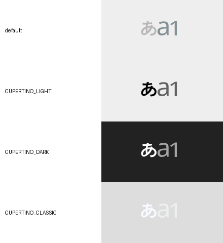

# Tenkey mode label sizing validation

Base: `origin/dev` at `17f7e9689f3f095cf62b926672410bc0ab207b27`.

The former Cupertino renderer sized labels against the entire key while the default used a vector drawable's intrinsic size and ImageView scaling. The new drawable reuses the original vector viewport, paths, fills, strokes, caps and joins. Custom font glyphs fit the original per-label bounds. The default artwork and active/idle skin colors are retained, including the shared Gojuon word icons.

## Reproduction and comparison

The new geometry regression failed before the fix (1,886 differing pixels in the first comparison). After the fix, every solid ink contour matches the reference within 1 px. Faint antialiasing pixels are excluded to accommodate the existing idle-label alpha.

The device comparison covers default and all three Cupertino palettes, Japanese/English/number, two/three-state keyboards, both number return targets, Tenkey/Gojuon, 240×120 / 90×180 / 70×45 pixel keys, and standard versus a TTF copied into the QA application's cache and loaded with Typeface.createFromFile. The temporary TTF is removed afterwards.



The four original transparent captures are alongside this document. The comparison adds contrasting backgrounds without resizing the captured glyphs.

## Results

- Core regression suites: 8 tests passed (InputModeSwitchSkinHighlightTest and KeyboardFontGlyphDrawableTest).
- Pixel 6 API 37: 6 tests passed (geometry matrix plus five existing Tenkey listener tests).
- ARM64 emulator API 24: 6 tests passed.
- ARM64 emulator API 29: 6 tests passed.
- ARM64 emulator API 36: 6 tests passed.
- Full Standard Debug and Lite Standard Debug builds passed with arm64-v8a.

The existing listener tests now initialize the themed layout on the UI thread, fixing three fixture failures that occurred before the product regression could be exercised.

## Reproduce

```sh
./gradlew :core:testDebugUnitTest --tests '*InputModeSwitchSkinHighlightTest' --tests '*KeyboardFontGlyphDrawableTest'
./gradlew -I investigation/floating-panel.init.gradle :app:assembleLiteStandardDebug :app:assembleLiteStandardDebugAndroidTest -Pandroid.injected.build.abi=arm64-v8a
./gradlew :app:assembleFullStandardDebug -Pandroid.injected.build.abi=arm64-v8a
```

Run InputModeSwitchGeometryDeviceTest and TenKeyInputModeChangedListenerTest in the isolated QA package. Device captures are written to its external files directory under `mode-label-comparison`.

The production IME installation/data were retained. The popup fixture used elsewhere restores the original default IME; the geometry/listener tests do not change IME selection.
